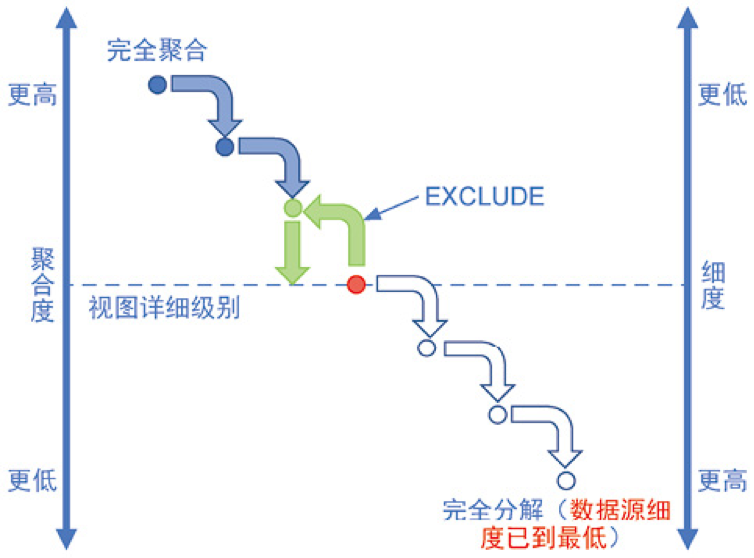
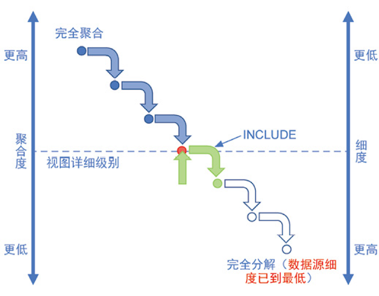
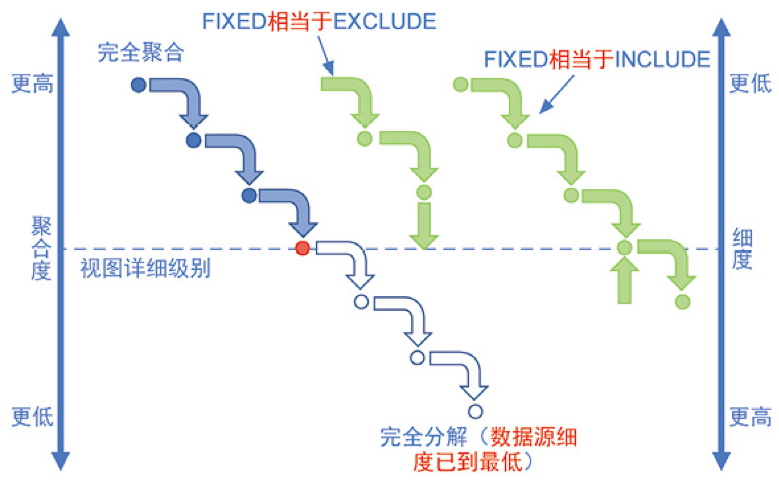
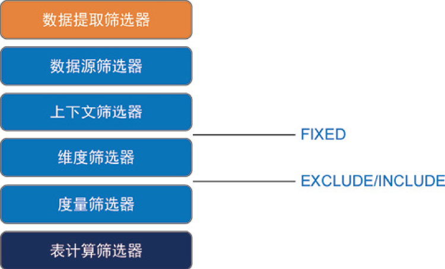
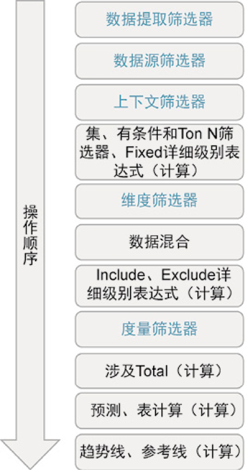

[TOC]

#1.合适的数据合并方式

$数据合并方式\begin{cases}连接 \begin{cases} 连接合并同一个数据库中的表\\ 连接合并不同数据库中的表 \\ 常见的问题\begin{cases} 无数据或缺数据\\ 重复数据\\ 多个值为NULL \\其中一个表全为NULL \end{cases} \end{cases}\\ 混合 \begin{cases}混合应用场景\begin{cases} 连接导致数据重复\\ 连接性能很慢\\ 数据需要在Tableau中做一些清理 \\ 数据位于不同的详细级别 \\ 想合并的数据来自跨数据库链接不支持的不同数据库 \end{cases}\\ 混合数据必备条件\begin{cases} 主数据源\\ 辅助数据源\\ 定义链接字段 \end{cases}\\ 混合常见问题\begin{cases}辅助数据源不存在与主数据源的关系\\ 主辅数据来自相同数据源中的表\\ 无法混合辅助数据源，一个或多个字段使用未支持的聚合\\ 辅助数据源中的LOD函数\\ 以主数据源形式发布数据源\\ 工作表出现（*）显示\\ 混合数据源后出现NULL值\\ 排序无法正常使用\\ URL动作的行为不符合预期\\ 动作筛选器未按预期方式工作\\ 数据源发布时，使用COUNTD函数的计算变得无效 \end{cases}  \end{cases}  \\ 并集\begin{cases} 应用场景：分析数据结构相同但时间段不同的表（这些表一般是按时间分开存储）\\ 并集操作步骤 \\ 需要注意的问题\begin{cases} 无法使用并集合并数据库存储的过程\\ 若要合并JSON文件，必须有.json、.txt或.log扩展名\\ 使用通配符搜索合并PDF文件中的表是，合并结果的范围限定与所连接的初始PDF文件中扫描的页面\\ 处理数据库时，可以将并集转换为自定义SQL\end{cases}\end{cases} \end{cases}$

**数据连接类型**：

内连接：使用内连接合并表，生成的表将包含与两个表均匹配的值

左连接：使用左连接合并表，生成的表将包含左侧表中的所有值以及右侧表中的对应匹配项。若左表在右表中没有对应匹配项，将在数据网格种显示NULL值

右连接：使用右连接合并表，生成的表将包含右侧表中的所有值以及左侧表中的对应匹配项。若右表在左表中没有对应匹配项，将在数据网格中显示NULL值

完全外连接：使用完全外部连接合并表时，生成的表将包含两个表中的所有值。若任何一个表的值在另一个表中没有匹配项，将在数据网格中显示NULL值

**注意点**：

1.若要对数据进行透视，必须使用同一链接中的文本列后Excel列，不能在透视中包括不同数据库中的列。

2.每个连接，Tableau发送独立查询，采用数据提取的文件格式将结果存储在一个临时表中。执行跨数据库连接时，会将临时表连接在一起，临时表是Tableau执行跨数据库连接必须的。

# 2.选择正确计算类型

计算类型包括：基本计算、LOD计算、表计算

计算类型选择

| 条件                                          | 是       | 否          |
| --------------------------------------------- | -------- | ----------- |
| （1）视图上存在所需分析的所有数据值           | 表计算   | 基本计算    |
| （2）问题粒度与图表粒度或数据源的粒度匹配     | 基本计算 | 使用LOD计算 |
| （3）问题需要排序、递归、移动计算或内部行计算 | 表计算   | 转条件（1） |

# 3.详细级别表达式(LOD)

**定义**：详细级别表达式是指不需要将实际维度拖入可视化内容中，就可以确定在计算中使用的详细级别（即维度），可以独立于视图的详细级别，定义应以什么详细级别来执行计算。

**语法**：{范围关键字[维度声明]:聚合方式([表达式])}

**关键字类型**：EXCLUDE、INCLUDE、FIXED

关键字执行原理如下：

EXCLUDE适用场景：对比销售额分析

INCLUDE适用场景：周期最后一天的价值问题

FIXED适用场景：客户订单频率、阵列分析、够买频次分析、新客户争取率、总额百分比

三种表达式的不同：

| 关键字  | 表达式作用                 | 表达式字段类型     | 筛选优先级 |
| ------- | -------------------------- | ------------------ | ---------- |
| EXCLUDE | 以较高的详细级别进行运算   | 度量/聚合度量      | 较低       |
| INCLUDE | 以较低的详细级别进行运算   | 度量/聚合度量      | 较低       |
| FIXED   | 指定确切的详细级别进行运算 | 度量/聚合度量/维度 | 较高       |

三种表达式在筛选分层中的位置：

# 4.表计算

表计算的函数种类包括汇总、差异、排序等等。添加表计算，必须使用详细级别的所有维度进行分区(划定范围)或寻址(定向)。分区字段用于定义计算分组方式的维度，寻址字段确定计算方向。

**表计算应用**：

排序(Rank)表计算应用

总计(Total)表计算应用

汇总(Total)表计算应用

窗口(Window)表计算应用

查找(Lookup)表计算应用

**表计算与详细级别表达式对比**

| 对比方向 | 表计算                                                       | 详细级别表达式-LOD函数                                       |
| -------- | ------------------------------------------------------------ | ------------------------------------------------------------ |
| 查询     | 在查询结果的基础上生成                                       | 针对基础数据源查询的一部分而生成，以嵌套选择的形式表现，依赖于DBMS数据管理系统的性能 |
| 详细级别 | 只能生成聚合度高于或等于视图详细级别的结果                   | 可生成聚合度高于或低于可视化详细级别的结果，也可以完全独立于可视化详细级别生成结果 |
| 计算方式 | 控制表计算运算的维度独立于计算语法，在"计算依据"和"计算因素"菜单中进行指定 | 控制详细级别表达式计算的维度嵌入在计算语法中，对于INCLUDE/EXCLUDE表达式，这些维度是相对于可视化详细级别而言；而对于FIXED表达式，这些维度是绝对的。 |
| 计算结果 | 始终是聚合度量                                               | 可用作度量、聚合度量或维度，数据类型由公式确定               |
| 筛选结果 | 针对表计算的筛选器可用做隐藏功能，它们不会从结果数据集中删除记录 | 针对详细级别表达式的筛选器可用作排除功能，它们会从结果数据集中删除记录。表达式的值会在可视化流程中的不同阶段进行计算，具体取决于表达式是FIXED还是INCLUDE/EXCLUDE |

# 5.Tableau操作执行顺序

操作顺序更改：提高低优先级的操作顺序（将字段添加到上下文）、降低高优先级的操作顺序

#6.如何应用双轴功能

$双轴应用\begin{cases} 双轴展示数据 \begin{cases} 双轴展示不同的指标信息\\ 双轴展示不同的数据粒度 \end{cases}\\   双轴制作图形\begin{cases}双轴制作环形饼图、嵌套饼图\\ 双轴制作标靶图\\\ 双轴制作哑铃图 \\ 双轴制作趋势饼图 \end{cases} \\ 双轴修饰图形 \begin{cases} 双轴为图形添加标记\\双轴异常数据点标注 \\ 双轴为图形添加形状\\ 双轴为图形添加轮廓\end{cases} \end{cases}$

#7.形状功能应用

$形状功能应用\begin{cases}形状代替具体的维度字段\\ 形状散点图\\ 用形状模拟数值动态变化\\ 仪表板中形状应用\begin{cases}  插入形状提示\\ 制作形状Logo \\ 制作形状动作按钮 \end{cases}\end{cases}$

#8.操作功能应用

操作可以在菜单栏中的"工作表"和"仪表板"中勾选设置

$操作类型\begin{cases} 筛选器\\ 突出显示 \\转到URL\end{cases}$

$运行操作3种方式\begin{cases}悬停\\ 选择\\ 菜单\end{cases}$

$撤销操作后的3种结果\begin{cases} 保留筛选器\\ 显示所有值 \\ 排除所有值\end{cases}$

$操作应用方式\begin{cases} \end{cases}$