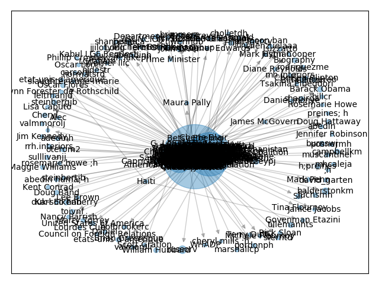
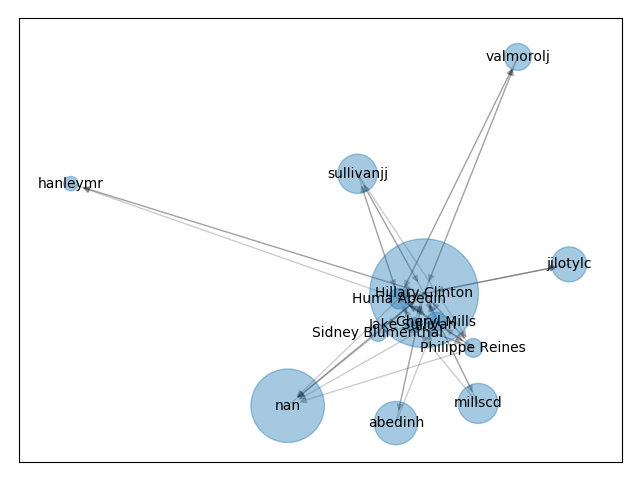

[TOC]

# PageRank

为解决早起搜索引擎的缺陷，受论文影响力因子的启发，当一篇论文被引用的次数越多，证明这篇论文的影响力越大，Google创始人拉里·佩奇提出来PageRank算法。

##**PageRank算法原理**

**出链**：链出去的链接

**入链**：链进来的链接

**一个网页的影响力 = 所有入链集合的页面加权影响力之和**，公式：

​			$PR(u) = \sum\limits_{v\in B_u}\dfrac{PR(v)}{L(v)}$

u为待评估的页面，$B_u$为页面u的入链集合。针对集合中的任意页面v，它能给u带来影响力是其自身影响力PR(v)除以v页面的出链数量，即页面v把影响力PR(v)平均分配给来它的出链，这样统计所有给u带来链接的页面v，得到的总和就是网页u的影响力，即PR(u)

假设ABCD四个网页的出链和如链数分别如下：

| 网页 |            出链数            |              入链数              |
| :--: | :--------------------------: | :------------------------------: |
|  A   | 3: $A\to B ,A\to C, A \to D$ | 2: $A\leftarrow B,A\leftarrow D$ |
|  B   |      2: $B\to A,B\to D$      | 2:$B\leftarrow A, B\leftarrow D$ |
|  C   |          1:$C\to A$          | 2:$C\leftarrow A,C\leftarrow D$  |
|  D   |      2:$D\to B,D\to C$       | 2:$D\leftarrow A, D\leftarrow B$ |

针对ABCD四个网页的链接网页情况，得到转移矩阵M:

​			$M = \begin{bmatrix} 0 & \dfrac{1}{2} &1&0\\ \dfrac{1}{3} &0&0&\dfrac{1}{2}\\ \dfrac{1}{3}&0&0&\dfrac{1}{2}\\ \dfrac{1}{3}&\dfrac{1}{2}&0&0\\ \end{bmatrix}$

假设ABCD四个页面的初始影响力都相同，(一般初始影响力都设为1/N)，即

​			$w_0 =\begin{bmatrix}  \dfrac{1}{4}\\ \dfrac{1}{4} \\ \dfrac{1}{4}\\ \dfrac{1}{4} \end{bmatrix} $

当进行第一次转移之后，各页面影响力变为：

$w_1=M\times w_0=\begin{bmatrix} 0 & \dfrac{1}{2} &1&0\\ \dfrac{1}{3} &0&0&\dfrac{1}{2}\\ \dfrac{1}{3}&0&0&\dfrac{1}{2}\\ \dfrac{1}{3}&\dfrac{1}{2}&0&0\\ \end{bmatrix} \begin{bmatrix}  \dfrac{1}{4}\\ \dfrac{1}{4} \\ \dfrac{1}{4}\\ \dfrac{1}{4} \end{bmatrix} = \begin{bmatrix} \dfrac{9}{24}\\ \dfrac{5}{24}\\ \dfrac{5}{24}\\ \dfrac{5}{24}\\ \end{bmatrix}$

然后再用转移矩阵$M\times w_1$得到$w_2$，直到第n次迭代后$w_n$的影响力不再发生变化，收敛到一个固定矩阵。这个时候就是N个页面最平衡状态下的影响力。权重越大，代表PR越高。这就是PageRank的计算过程。

实际情况中，会存在：

1.**等级泄露（Rank Leak）**: 如果网页只有入链，会造成其它网页的PR值为0

2.**等级沉没(Rank Sink)**: 如果网页只有出链，会造成这个网页的PR值为0

为解决上述问题，拉里·佩奇 提出来**PageRank随机浏览模式**。

定义来阻尼因子d，而1-d则代表来用户是不是通过跳转链接的方式来访问网页的，公式为：

$PR(u) = \dfrac{1-d}{N} + d\sum\limits_{v\in B_u} \dfrac{PR(v)}{L(v)}​$

最终PageRank随机浏览模型可以收敛到固定值，得到一个稳定正常的PR值。

##**PageRank 的应用**

1.社交影响力评估

2.个人职场影响力

3.公司影响力

4.行业影响力

5.文学作品影响力

6.图书推荐影响力

其它可以应用的方面也还有很多

##**PageRank实践**

1.针对上面的网络例子，进行实践

```python
import networkx
#创建有向图
digraph = networkx.DiGraph()
#有向图之间边的关系
edges = [("A", "B"), ("A", "C"), ("A", "D"), ("B", "A"), ("B", "D"), ("C", "A"), ("D", "B"), ("D", "C")]
for edge in edges:
    digraph.add_edge(edge[0],edge[1])
pagerank_list = networkx.pagerank(digraph, alpha=1)
print('PageRank 值是：',pagerank_list)
```

输出结果：

```python
PageRank 值是： {'A': 0.33333396911621094, 'B': 0.22222201029459634, 'C': 0.22222201029459634, 'D': 0.22222201029459634}
```

2.希拉里邮件人物关系

```python
import pandas as pd
import networkx as  nx
import  numpy as np
from collections import defaultdict
import matplotlib.pyplot as  plt

#数据加载
path = '/Users/apple/Desktop/GitHubProject/Read mark/数据分析/geekTime/data/'
emails = pd.read_csv(path + 'xilali_email/Emails.csv')
#读取别名文件
file = pd.read_csv(path + 'xilali_email/Aliases.csv')
aliases = {}
for index,row in file.iterrows():
    aliases[row['Alias']] = row['PersonId']
#读取人名文件
pers_file = pd.read_csv(path + '/xilali_email/Persons.csv')
persons = {}
for index,row in pers_file.iterrows():
    persons[row['Id']] = row['Name']

#针对别名进行转换
def unify_name(name):
    name = str(name).lower()
    name = name.replace(",","").split("@")[0]
    if name in aliases.keys():
        return persons[aliases[name]]
    return name

#画网络图
def show_graph(graph):
    #使用Spring Layout布局，类似中心放射状
    positions = nx.spring_layout(graph)
    #设置网络图的节点大小，大小与pagerank值相关，因为pagerank值很小所以需要*20000
    nodesize = [x['pagerank']*20000 for v,x in graph.nodes(data=True)]
    #设置网络图中的边长度
    edgesize = [np.sqrt(e[2]['weight']) for  e in  graph.edges (data=True)]
    #绘制节点
    nx.draw_networkx_nodes(graph, positions, node_size=nodesize,alpha=0.4)
    #绘制边
    nx.draw_networkx_edges(graph, positions, edge_size = edgesize,alpha=0.2)
    #绘制节点的label
    nx.draw_networkx_labels(graph, positions, font_size=10)
    #输出网络图
    plt.show()

#将寄件人核收件人的姓名进行规范化
emails.MetadataFrom = emails.MetadataFrom.apply(unify_name)
emails.MetadataTo = emails.MetadataTo.apply(unify_name)

#设置边的权重等于发邮件的次数
edges_weights_temp = defaultdict(list)
for row in zip(emails.MetadataFrom, emails.MetadataTo, emails.RawText):
    temp = (row[0],row[1])
    if temp not in edges_weights_temp:
        edges_weights_temp[temp] = 1
    else:
        edges_weights_temp[temp] = edges_weights_temp[temp] + 1
#转换格式(from, to), weight => from, to, weight
edges_weights = [(key[0],key[1],val) for key, val in edges_weights_temp.items()]

#创建一个有向图
graph = nx.DiGraph()
#设置有向图的路径及权重
graph.add_weighted_edges_from(edges_weights)
#计算每个节点（人）的PR值，并作为节点的pagerank属性
pagerank = nx.pagerank(graph)
#获取每个节点的pagerank值
pagerank_list = {node: rank for node, rank in pagerank.items()}
#将pagerank值作为节点的属性
nx.set_node_attributes(graph, name='pagerank',values=pagerank_list)
#画网路图
show_graph(graph)

#将完整的图谱进行精简
#设置PR值的阈值，筛选大于阈值的重要核心节点
pagerank_threshold = 0.005
#复制一份计算好的网络图
small_graph = graph.copy()

#剪掉PR值小于pagerank_threshold的节点
for n, p_rank in graph.nodes(data=True):
    if p_rank['pagerank'] < pagerank_threshold:
        small_graph.remove_node(n)

#画网络图
show_graph(small_graph)
```

输出结果






**函数及参数**:

1.networkx可视化布局：

​	spring_layout：呈中心放射状

​	circular_layout:在一个圆环上均匀分布

​	random_layout:随机分布节点

​	shell_layout:节点都在同心圆上

2.add_weighted_edges_from:添加边权重 ,参数为u、v、w的三元数组