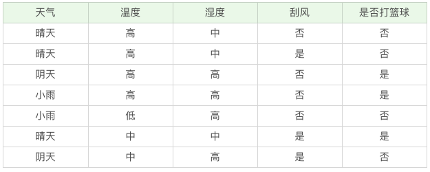
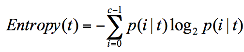
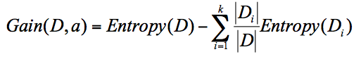

[TOC]

#决策树

决策树一个树状逻辑结构图，有根节点、子节点、叶子结点

## **决策树工作原理**

做决策树的时候会经历两个阶段：**构造和剪枝**

##**构造**

构造就是生成一颗完整的决策树。**构造的过程就是选择什么属性成为节点的过程**。

构造过程存在三种节点：

1.根节点：就是树的最顶端，最开始的那个节点。

2.内部节点：就是树中间的那些节点

3.叶节点：就是树最底部的节点

构造过程中需要解决的三个重要问题：

1.选择那种属性作为根节点

2.选择哪些属性作为子节点

3.什么时候停止并得到目标状态，即叶子结点

##**剪枝**

剪枝就是给决策树瘦身，这一步不需要太多的判断，同样可以得到不错的结果。要防止**"过拟合"(Overfitting)**现象的发生。

**过拟合**是指模型的训练结果太过完美，以至于在实际应用的过程中，会存在"死板"的结果，导致分类错误。预支对应的是欠拟合。

 过拟合结果造成的重要原因之一：训练集中样本数量较小。

数量小选择的属性过多，会把训练集中一些数据的特点当成所有数据的特点，但该特点不一定是全部数据的特点。造成决策树在真是的数据分类中出现错误，也就是模型的**泛化能力**差。

**泛化能力**：分类器通过训练集抽象出来的分类能力。

剪枝分为`预剪枝`(Pre-Pruning ) 和`后剪枝`(Post-Pruning)

预剪枝是在决策树构造时就进行剪枝，方法是在构造过程中对节点进行评估，如果对某个节点进行划分，在验证集中不能带来准确性的提升，那么对这个节点进行划分意义不大，这时就会把当前节点作为叶子结点，不对其进行划分。

 后剪枝就是在生成决策树之后再进行剪枝，从决策树的叶子结点开始，逐层向上对每个节点进行评估。如果剪掉该节点子树与保留该节点子树在分类准确性上差别不大，或者剪掉该节点子树，能在验证集中带来准确性的提升，那么就把该节点子树进行剪枝。方法是用这个节点子树的叶子结点来代替该节点，类标记为这个节点子树中最频繁的那个类。

在以下训练集基础上构建决策树




##**纯度和信息熵**

纯度：让目标变量的分歧最小，可以把决策树的构造过程理解成为寻找纯净划分的过程。

信息熵(entropy)：表示信息的不确定度。数学公式 



例如两个集合：

集合 1：5 次去打篮球，1 次不去打篮球；

集合 2：3 次去打篮球，3 次不去打篮球。

用公式求得

集合1的信息熵E(t)= 0.65

集合2的信息熵E(t)= 1

从计算结果中可以得出结论：信息熵越大，纯度越低。当集合中的所有样本均匀混合，信息熵最大，纯度最低。

构造决策树会基于纯度来构建，经典的"不纯度"指标有三种：**信息增益(ID3算法)**、**信息增益率(C4.5算法)** 以及**基尼指数(Cart算法)**

##**ID3算法**

ID3算法计算的是信息增益，信息增益指的是划分可以带来纯度的提高，信息熵的下降。计算公式是：父亲节点的信息熵减去所有子节点的信息熵。



首先计算根节点的信息熵，共有7条数据，3次打篮球，4次不打篮球

Ent(D) = -( $ \dfrac{3}{7} $  $\log _2 ^ {\tfrac{3}{7}} $ + $\dfrac{4}{7}$ $\log_2^{\tfrac{4}{7}}$ ) = 0.985

**.**如果以天气作为属性划分，会有$D_1$、$D_2$ 、$D_3$

$D_1$ (天气=晴天) = {1次打，2次不打}

$D_2$ (天气=阴天) = {1次打，1次不打}

$D_3$ (天气=小雨) = {1次打，1次不打}

Ent($D_1$) = -($\dfrac{1}{3}$$\log_2^{\tfrac{1}{3}}$ + $\dfrac{2}{3}\log_2^{\tfrac{2}{3}}$) = 0.918

Ent($D_2$) =1

Ent($D_3$) = 1

∴归一化信息熵 = $\dfrac{3}{7} \times 0.918 + \dfrac{2}{7} \times1 +\dfrac{2}{7} \times 1$ = 0.965

∴G(D,天气) = 0.985 - 0.965 = 0.020

**.**如果温度作为属性划分，会有$D_1$、$D_2$ 、$D_3$

$D_1$ (温度=高) = {2次打，2次不打}

$D_2$ (温度=低) = {1次不打}

$D_3$ (温度=中) = {1次打，1次不打}

Ent($D_1$) = 1

Ent($D_2$) = -$\log_2^1$ = 0

Ent($D_3$) = 1

∴归一化信息熵 = $\dfrac{4}{7} + 0 + \dfrac{2}{7}\times1$ =0.857

∴G(D,温度) = 0.985 - 0.857 = 0.128

同样可得到

G(D,湿度) = 0.020

G(D,刮风) = 0.020

综上可得，温度的信息增益最高，所以选择温度作为根节点。

然后分别针对温度的$D_1 D_2 D_3$ 三个子集往下划分算其不同属性）(天气、湿度、刮风)作为节点的信息增益，最终得到以下决策树。


ID3优点：方法简单

ID3 缺点：

（1）有些属性对分类任务没有太大作用，但是仍然可能会作为最优属性。

（2）容易产生过拟合。

（3） 训练数据如果有少量错误，可能会产生决策树分类错误。


##**C4.5算法**

因为ID3存在着缺陷，在ID3算法上改进形成来C4.5算法

1.采用信息增益率

 ID3在计算的时候，倾向于选择去至多的属性。为了避免这个问题，C4.5采用信息增益率方式来选择属性。信息增益率 = 信息增益/属性熵 

当属性有很多值得时候，相当于被划分成来许多份，虽然信息增益变大来，但是对于C4.5来说，属性熵也会变大，所以整体的信息增益率并不大。

2.采用悲观剪枝

ID3 构造决策树的时候，容易产生过拟合的情况。在 C4.5 中，会在决策树构造之后采用悲观剪枝（PEP），这样可以提升决策树的泛化能力。

悲观剪枝是后剪枝技术中的一种，通过递归估算每个内部节点的分类错误率，比较剪枝前后这个节点的分类错误率来决定是否对其进行剪枝。这种剪枝方法不再需要一个单独的测试数据集。

3.离散化处理连续属性

C4.5 可以处理连续属性的情况，对连续的属性进行离散化的处处理。比如打篮球存在的“湿度”属性，不按照“高、中”划分，而是按照湿度值进行计算，那么湿度取什么值都有可能。该怎么选择这个阈值呢，C4.5 选择具有最高信息增益的划分所对应的阈值。

4.处理缺失值

针对数据集不完整的情况，C4.5 也可以进行处理。若样本在这个属性上有缺失值，则对样本进行划分的时候不考虑缺失值。

C4.5算法缺点：构造决策树，需要对数据进行多次扫描和排序，效率低

## **ID3算法课后练习**

| 编号 |  红  |  大  | 好苹果 |
| :--: | :--: | :--: | :----: |
|  1   |  是  |  是  |   是   |
|  2   |  是  |  否  |   是   |
|  3   |  否  |  是  |   否   |
|  4   |  否  |  否  |   否   |
根集合D = {2个好苹果，2个不是号苹果}，求得Ent(D) =  1。

按红作为属性划分可得$D_1、D_2$两个子集

$D_1$ (红 = 是) = {2个好苹果}

$D_2$ (红= 否) = {2个不是好苹果}

可得Ent( $D_1$ ) = 0 、Ent( $D_2$ ) = 0

可得归一化信息熵为$\dfrac{1}{2} \times 0 + \dfrac{1}{2} \times 0 $ = 0

则G(D,红) = 1-0 = 1

按大作为属性，同样可得 $D_1、D_2$两个子集

$D_1$ (大 = 是) = {1个好苹果，1个不是好苹果}

$D_2$ (大 = 否) = {1个好苹果，1个不是好苹果}

可得Ent( $D_1$ ) = 1 、Ent( $D_2$ ) = 1

归一化信息熵 = $\dfrac{2}{4}\times1 + \dfrac{2}{4}\times1$ = 0.5

则G（D，大）= 1- 0.5 = 0.5

由此可得按红作为属性的信息增益大于按大作为属性的信息增益，所以选择红作为根节点。

接着在红为是的基础上，分析按大作为属性的信息增益。在红为是的集合里共有两个苹果集合D = {2个好苹果} Ent(D) = 0

$D_1$ (大 = 否) = {1个好苹果}

$D_2$ (大 = 是) = {1个好苹果} 

Ent( $D_1$ ) = 0 、Ent( $D_2$ ) = 0

G(D，大) = 0

因为大是与否在红决定的前提下对好苹果的决定没有影响，所以剪去该分支。

##**CART算法**

CART算法：Classification And Regression Tree ，分类回归树。ID3 和C4.5算法可以生成二叉树或多叉树，而**CART算法只支持二叉树**。同时CART算法比较特殊，既可以作为分类树，又可以作为回归树。

分类树可以处理离散数据，也就是数据种类有限的数据，它输出的是样本的类别，而回归树可以对连续的数值进行预测，也就是数据在某个区间内都有去值的可能，它输出的是一个数值。

###**CART分类树的工作流程：基尼系数**

CART在计算"不纯度"时采用的指标是**基尼系数**。基尼系数反应来样本的不确定性，基尼系数越小，说明样本之间的差异性小，不确定程度低。**CART在构造分类树的时候，会选择基尼系数最小的属性作为属性的划分**。

GINI系数计算公式为：

​				**GINI(t) = $1-\sum_k[p(C_k|t)^2]$**

$p(C_k|t)$ 表示节点t属于类别$C_k$ 的概率，节点t的基尼系数为1减去各类别$C_k$ 概率平方和。

举例：

集合 1：6 个都去打篮球；

集合 2：3 个去打篮球，3 个不去打篮球

针对集合1，$p(C_k|t)$ = 1， 因此GINI(t) = 1- 1 = 0

针对集合2，$p(C_1|t)$ = 0.5 ，$p(C_2|t)$ = 0.5

GINI(t)  = 1- ($0.5^2 + 0.5^2$) = 0.5

可以看出集合1基尼系数最小，证明样本最稳定，而集合2的样本基尼系数大，不稳定性大。

在CART算法中，基于基尼系数对特征属性进行二元分裂，节点D的基尼系数等于子节点$D_1$和$D_2$的归一化基尼系数之和，用公式表示为：

​		$GINI(D,A)=\dfrac{D_1}{D}GINI(D_1) + \dfrac{D_2}{D}GINI(D_2)$

根据上面计算出的$GINI(D_1) 、GINI(D_2)$ 可以得到D的基尼系数为

$GINI(D,A) = \dfrac{6}{12}GINI(D_1) + \dfrac{6}{12}GINI(D_2)$ = 0.25

###**构造CART分类树**

在 Python 的 sklearn 中，如果我们想要创建 CART 分类树，可以直接使用DecisionTreeClassifier 。创建这个类的时候，默认情况下criterion这个参数等于gini，默认采用的是CART分类树

```python
>>> from sklearn.model_selection import train_test_split
>>> from sklearn.metrics import accuracy_score
>>> from sklearn.tree import DecisionTreeClassifier
>>> from sklearn.datasets import load_iris
>>> import ssl
>>> ssl._create_default_https_context = ssl._create_unverified_context
>>> #准备数据集
>>> iris = load_iris()
>>> #获取特征集合分类标识
>>> features = iris.data
>>> labels = iris.target
>>> #随机抽取33%的数据作为测试集，其余为训练集
>>> train_features, test_features, train_labels, test_labels = train_test_split(features, labels, test_size = 0.33, random_state=0)
>>> #创建CART分类树
>>> clf = DecisionTreeClassifier(criterion = 'gini')
>>> #拟合构造CART分类树
>>> clf = clf.fit(train_features, train_labels)
>>> #用CART分类树做预测
>>> test_predict = clf.predict(test_features)
>>> #预测结果与测试集结果作比对
>>> score = accuracy_score(test_labels, test_predict)
>>> print ("CART分类树准确率 %.4lf" %score)
CART分类树准确率 0.9600

```

### **CART回归树的工作流程：LAD&LSD**

回归树得到的预测结果是连续的，而且评判"不纯度"的指标不同。CART回归树中采用样本的离散度作为"不纯度"的评判标准。

样本离散程度具体计算方式：

样本值减去样本均值的绝对值：

​							$|x-u|$

样本值减去样本均值的平方和除以样本个数：

​				$s = \dfrac{1}{n}\sum(x-u)^2$

两种节点划分的标准，分别对应着两种目标函数最优化的标准，用最小绝对偏差(LAD)，或者最小二乘偏差(LSD)。后者更长见一些

### **使用CART回归树做预测**

```python
>>>from sklearn.metrics import mean_squared_error
>>>from sklearn.model_selection import train_test_split
>>>from sklearn.datasets import load_boston
>>>from sklearn.metrics import r2_score,mean_absolute_error,mean_squared_error
>>>from sklearn.tree import DecisionTreeRegressor
>>> #准备数据集
>>> boston = load_boston()
>>> #获取特征值
>>> features = boston.data
>>> prices = boston.target
>>> #随机抽取33%的数据作为测试集，其余为训练集
>>> train_features,test_features,train_price,test_price = train_test_split(features,prices,test_size=0.33, random_state=0)
>>> dtr = DecisionTreeRegressor()
>>> dtr.fit(train_features,train_price)
DecisionTreeRegressor(criterion='mse', max_depth=None, max_features=None,
           max_leaf_nodes=None, min_impurity_decrease=0.0,
           min_impurity_split=None, min_samples_leaf=1,
           min_samples_split=2, min_weight_fraction_leaf=0.0,
           presort=False, random_state=None, splitter='best')
>>> predict_price = dtr.predict(test_features)
>>> print ('回归树二乘偏差均值：',mean_squared_error(test_price,predict_price))
回归树二乘偏差均值： 25.709580838323355
>>> print ('回归树绝对值偏差均值：',mean_absolute_error(test_price,predict_price))
回归树绝对值偏差均值
```

###**CART决策树剪枝**

CART 决策树的剪枝主要采用的是 CCP 方法，它是一种后剪枝的方法，英文全称叫做cost-complexity prune，中文叫做代价复杂度。这种剪枝方式用到一个指标叫做节点的表面误差率增益值，以此作为剪枝前后误差的定义。用公式表示则是：

​			$\alpha = \dfrac{C(t)-C(T_t)}{|T_t| -1}$

希望剪枝前后误差最小，所以我们要寻找的就是最小α值对应的节点，把它剪掉。这时候生成了第一个子树。重复上面的过程，继续剪枝，直到最后只剩下根节点，即为最后一个子树。得到了剪枝后的子树集合后，我们需要用验证集对所有子树的误差计算一遍。可以通过计算每个子树的基尼指数或者平方误差，取误差最小的那个树，得到我们想要的结果。

总结：

ID3:基于信息增益做判断

C4.5：基于信息增益率做判断

CART：分类树基于基尼系数做判断，回归树基于偏差做判断

###**CART课后练习**

sklearn 中有个手写数字数据集，调用的方法是 load_digits()，你能否创建一个 CART 分类树，对手写数字数据集做分类？另外选取一部分测试集，统计下分类树的准确率？

```python
>>>from sklearn.model_selection import train_test_split
>>>from sklearn.metrics import accuracy_score
>>>from sklearn.tree import DecisionTreeClassifier
>>>from sklearn.datasets import load_digits
>>>import ssl
>>>ssl._create_default_https_context = ssl._create_unverified_context
>>>#准备数据
>>>digits = load_gigits()
>>>#获取特征集和分类标识
>>>features = digits.data
>>>labels = digits.target
>>> #随机抽取40%作为测试数据，其余作为训练集
>>>train_features,test_features,train_labels,test_labels = train_test_split(features,labels, test_size = 0.40, random_state = 0)
>>>#创建CART分类树
>>>clf = DecisionTreeClassifier(criterion='gini')
>>>#拟合构建CART分类树
>>>clf.fit(train_features, train_labels)
>>>#用CART分类树做预测
>>>test_predic = clf.predict(test_features)
>>>#预测结果与测试结果做比对
>>>score = accuracy_score(test_labels, test_predic)
>>>print ('CART分类树准确率%.4lf', %score)
CART分类树准确率0.8164
```


##**决策树实践：泰坦尼克乘客生存预测**

sklearn中只实现了ID3与CART两种决策树，字段criterion 取值决定构造哪种决策树。取值为'entroy' 或'gini'

###**DecisionTreeClassfier参数含义**


**统计决策树分类器准确率方法-K折交叉验证**

K 折交叉验证的原理是这样的：

1.将数据集平均分割成 K 个等份；

2.使用 1 份数据作为测试数据，其余作为训练数据；

3.计算测试准确率；

4.使用不同的测试集，重复 2、3 步骤。

**决策树模型使用技巧总结**：

1.特征选择是分类模型好坏的关键。选择什么样的特征，以及对应的特征值矩阵，决定了分类模型的好坏。通常情况下，特征值不都是数值类型，可以使用DictVectorizer类进行转化；

2.模型准确率需要考虑是否有测试集的实际结果可以做对比，当测试集没有真实结果可以对比，需要使用K折交叉验证cross_val_score;

3.Graphviz 可视化工具可以很方便地将决策模型呈现出来，帮助更好的理解决策树。

**DictVectorizer类中fit_transform 和 transform函数两者的区别**

tranform 函数是在fit基础上，进行标准化，降维，归一化等操作

fit_transform 是fit 和 transform的组合，既包括了训练又包含来转换。transform()和fit_transform()二者的功能都是对数据进行某种统一处理，fit_transform(trainData)对数据部分先拟合fit，找到part的整体指标，如均值、方差、最大值，然后对该trainData进行转换transform，从而实现数据的标准化、归一化

### **实践代码**

```python
import pandas as pd
from sklearn.model_selection import train_test_split
from sklearn.feature_extraction import DictVectorizer
from sklearn.tree import DecisionTreeClassifier
from sklearn.metrics import classification_report
from sklearn.model_selection import cross_val_score
from sklearn import tree
train_data = pd.read_csv('/Users/apple/Desktop/GitHubProject/Read mark/数据分析/geekTime/data/Titannic_Data_train.csv')
test_data = pd.read_csv('/Users/apple/Desktop/GitHubProject/Read mark/数据分析/geekTime/data/Titannic_Data_test.csv')
#了解数据表的基本情况
print (train_data.info())
print ('-' *30)
#了解数据表的统计情况
print (train_data.describe())
print ('-' *30)
#查看字符串类型的整体情况
print (train_data.describe(include=['O']))
print ('-' *30)
#使用head查看前几行数据
print (train_data.head())
print ('-' *30)
#使用tail查看后几行数据
print (train_data.tail())
#使用平均年龄填充年龄nan值
train_data['Age'].fillna(train_data['Age'].mean(), inplace=True)
test_data['Age'].fillna(test_data['Age'].mean(), inplace = True)
print (train_data['Embarked'].value_counts())
#使用登录最多的港口来进行填充港口nan缺失
train_data['Embarked'].fillna('S', inplace=True)
test_data['Embarked'].fillna('S', inplace=True)
#特征选择
features = ['Pclass','Sex','Age','SlibSp','Parch','Embarked']
train_features = train_data[features]
train_labels = train_data['Survived']
test_features = test_data[features]
devc = DictVectorizer(sparse=False)
train_features = devc.fit_transform(train_features.to_dict(orient='record'))
print (devc.feature_names_)
#构造ID3决策树
clf = DecisionTreeClassifier(criterion='entropy')
#决策树训练
clf.fit(train_features, train_labels)
test_features = devc.transform(test_features.to_dict(orient='record'))
#决策树预测
pred_labels = clf.predict(test_features)
#得到决策树准确率
acc_decision_tree = round(clf.score(train_features, train_labels),6)
print ('score准确率为%.4f' % acc_decision_tree)
#使用K折交叉验证 统计决策树准确率
print ('cross_val_score准确率为%.4lf' % np.mean(cross_val_score(clf, train_features,train_labels,cv=10)))
with open("jueceshu.dot",'w') as f:
    f = tree.export_graphviz(clf, out_file = f)
```

