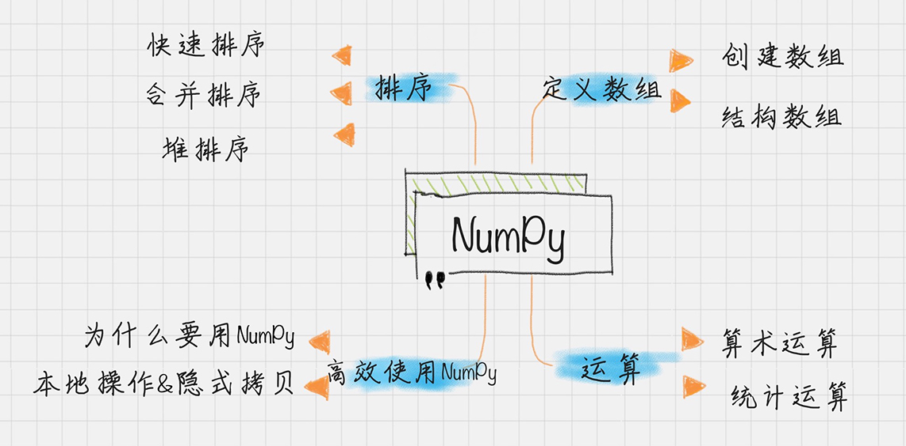
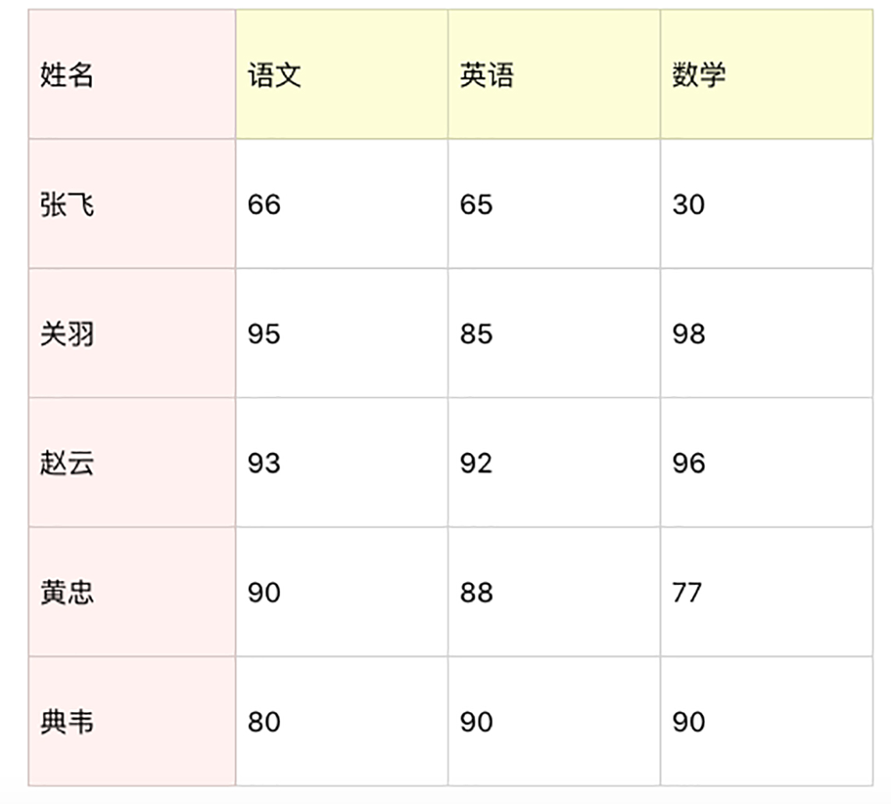

[TOC]

#数据挖掘知识清单


#数据分析之Python基础

Python语言采用代码缩进和冒号的方式来区分代码之间的层次关系，所以代码缩进在Python中是一种语法，如果代码缩进不统一，会产生错误或者异常，相同层次的代码一定要采用相同层次的缩进。

Python IDE：  PyCharm(写爬虫) 、 Sublime Text 、 Vim、Eclipse + PyDev 、IDLE  、jupyter notebook+spyder3（数据分析主要IDE）

若用IDLE 编译  一行代码一回车   

**基本语法**： 输入输出 ： input (Python 2.7  用 raw_input)、 print (与其它语言一样%s 代表字符串，%d代表整数)

**注释**： 注释在Python中使用#，如果注释中有中文，一般会在代码前添加#— coding：utf-8 -  

如果是多行注释，使用三个单引号，或者三个双引号。

**引用模块** ：导入一个模块  import model_name ,导入多个模块  import model_name, anthor_model,导入包中指定模块 from package_name import moudule_name;导入包中所有模块 from package_name import *

##**循环控制**

###**if … else ...**

```python
      if score>= 90:
      print 'Excellent'
else:
       if score < 60:
           print 'Fail'
       else:
           print 'Good Job'
```

###**for … in** 

```python
sum = 0
for number in range(11):
    sum = sum + number
print sum
```

若规定循环次数，可以使用range函数，在for循环里比较常见，range(11)代表从0到10，不包括11，也相当于range(0，11)，range里面还可以增加步长，比如range(1，11，2)代表的是[1，3，5，7，9]

###**while循环**

```python
sum = 0
number = 1
while number < 11:
       sum = sum + number
       number = number + 1
print sum
```

while循环对于变量计算方式更加灵活。因此while循环适合循环次数不确定的循环，而for 循环的条件相对确定，适合固定次数的循环。

**多重赋值**

```python
a = b = c = 100
```

##**标准数据类型**

Python中目前定义了五种标准数据类型，用于存储各种数据类型

```python
.Numbers (数字)
.String ()
.List
.Tuple
.Dictionary
```

此外还有集合Set 标准数据类型，同Dictionary类型

###**列表 List**

```python
lists = ['a','b','c']
lists.append('d')
print lists
print len(lists)
lists.insert(0,'mm')
lists.pop()
print (len(lists)) //Python3.0 语法
del lists[0]
print (max(lists))
print (lists.count('a'))

```

列表是Python中的常用数据结构，append()在尾部添加元素，insert()在列表中插入元素，使用pop()删除尾部的元素，使用len()计算列表长度，使用del删除列表指定位置的元素，使用max()找出列表中最大的元素，使用count()计算某个目标值在数组中出现的次数

###**元组(Tuple)**

```python
>>> tupe = ('tupeA','tupeB')
>>> tupe_first = "a","b","c"
>>> tupe_second = (50,)
>>> print (tupe[0])
tupeA
>>> tupe_third = tupe + tupe_first
>>> print (tupe_third)
('tupeA', 'tupeB', 'a', 'b', 'c')
>>> del tupe_third
>>> print (len(tupe))
2
>>> 
```

Python的元组与列表类似，但是元组一旦创建就不能修改，不过我们可以通过两个元组拼接的形式进行修改，元组不能删除某个指定元素，但用del()函数可以直接将整个元组删除；元组中只包含一个元素时，需要在后面添加逗号，否则最后一个）会当运算符计算;len()函数会返回元组的个数。

###**字典(Dictonary)**

字典是key:value的容器模型，键值必须唯一，但值则不必唯一

```python
>>> dictionary = {'Alice': 17,'Beth': 19}
>>> dictionary = {'Name': 'Alice', 'Age': 17, 'Class': 'First'}
>>> print (dictionary['Name'])
Alice
>>> dictionary['Age'] = 18
>>> del dictionary['Class']
>>> dictionary.clear
<built-in method clear of dict object at 0x10d85ebd0>
>>> del dictionary
>>> dictionary = {'Name': 'Beth', 'Age': 17, 'Class': 'First','Name': 'Alice'}
>>> print (len(dictionary))
3
>>> str(dictionary)
"{'Name': 'Alice', 'Age': 17, 'Class': 'First'}"
```

访问字典里的值直接通过访问key的形式，修改字典中的元素也是同样用直接访问key的形式进行重新赋值；

del dictionary['key'] 是删除字典中key：value键值对  clear()函数是清空字典， del dictionary 是直接将整个字典删除；因字典中不允许同一个键出现两次，所以后赋值的会替换掉前面的，键必须不可变，所以用数字，字符串或元组充当，而不能用列表；len()函数计算字典中元素个数，即建的总数。str()函数是以可打印字符串表示输出字典。

###**集合(Set)**

集合与列表存储结构相似，不同的是集合是无序的且不重复。

```python
>>> basket = {'apple','orange','apple','pear','orange','banana'}
>>> print (basket)
{'pear', 'apple', 'banana', 'orange'}
>>> 'orange' in basket
True
>>> 'pich' in basket
False
>>> a_set = set('abracadabra')
>>> a_set
{'a', 'd', 'c', 'b', 'r'}
>>> b_set = set('alacazam')
>>> b_set
{'m', 'c', 'z', 'l', 'a'}
>>> a_set - b_set  #集合a中包含而集合b中不包含的元素
{'d', 'r', 'b'}
>>> a_set | b_set #集合a或集合b中包含的所有元素
{'m', 'd', 'c', 'z', 'l', 'a', 'b', 'r'}
>>> a_set & b_set #集合a和集合b中共同包含了的元素
{'c', 'a'}
>>> a_set ^ b_set #不同时包含于a和b的元素
{'m', 'z', 'l', 'd', 'b', 'r'}
>>> s_set = {x for x in 'abracadabra' if x not in 'abc'}
>>> s_set
{'d', 'r'}
>>> a_set.add(x)
Traceback (most recent call last):
  File "<pyshell#99>", line 1, in <module>
    a_set.add(x)
NameError: name 'x' is not defined
>>> a_set.add('x')
>>> a_set.update('s')
>>> a_set.remove('s')
>>> a_set.discard('s')
>>> a_set.pop
<built-in method pop of set object at 0x10d906668>
>>> len(a_set)
6
>>> 'a' in a_set
True
>>> a_set.clear()
>>> a_set.isdisjoint(b_set)
True
>>> a_set.issubset(b_set)
True
>>> a_set.issuperset(b_set)
False
>>> 
```

空集合的创建不能用{},必须用set()，因为{}是创建空字典。 与字典相同 可直接通过'x' in 结合的形式判断集合中是否有该元素，若有则返回True，若没有该元素，则返回False；两个集合可通过 '-' 、'|'、'&'、'^'四个运算符求与或非等操作；add()可以向集合中添加元素，另外一种添加方式是update()，该方式可以将列表、字典等元素添加到集合中；remove()可以移除集合中的元素，另一种移除方式是discard(),此种方式在集合中没有要移除的元素的时候不会报错；pop()是随机移除，len()是求集合长度；clear()是清空集合；isdisjoint()是判断集合中是否包含相同的元素，如果没有返回True，否则返回False；issubset()判断指定集合是否为该方法参数集合的子集合，issuperset()判断该方法的参数集合是否为指定集合的子集。

##**函数**

Python中函数分为内建函数和自定义函数，自定义函数以 def关键字开头，后接函数标识符名称和圆括号。

任何传入参数和自变量必须放在圆括号中间，圆括号之间可以用于定义参数。

函数的第一行语句可以选择性地使用文档字符串-用于存放函数说明

函数内容以冒号起始，并且缩进。

return[表达式]结束函数，选择性德返回一个值给调用方，不带表达式的return相当于返回None

```python
>>> def area(width, height):
	return width * height

>>> print ("with =",w,"height =",h,"area =",area(w,h))
with = 34 height = 25 area = 850
```

###**参数传递**

Python中，类型属于对象，变量是没有类型的。

####**可更改(mutable)与不可更(immutable)改对象**:

在Python中，string，tuples和numbers是不可更改的对象，而list，dictionary等则是可以修改的对象

**.不可变类型** ： 变量赋值a = 5后，再赋值 a = 10，这里实际是新生成一个int对象10，再让a指向它，而原来的5以及原来占用的内存都被废弃，相当于重新生成了a。

**.可变类型** : 变量赋值la = [1,2,3,4]后再赋值 la[2] = 5 则是将 list la中的第三个元素更改，并没有改变list la的内存指向。

####**参数类型**

**.必需参数** :以正确的方式传入函数，调用时的数量必须和声明时一致

**.关键字参数** ：使用关键字参数允许函数调用时参数的顺序与生命不一致，因为Python解释器能够用参数名称匹配参数值

```python
#可写函数说明
def printinfo( name, age ):
   "打印任何传入的字符串"
   print ("名字: ", name)
   print ("年龄: ", age)
   return
 
#调用printinfo函数
printinfo( age=50, name="runoob" )
```


**.默认参数**  调用函数时，如果没有传递参数，则会使用默认参数

```python
>>> def printinfo(name, age = 35):
	"打印任何传入的字符"
	print ("名字:", name)
	print ("年龄:", age)
	return

>>> printinfo( age = 50, name = "Joe")
名字: Joe
年龄: 50
>>> printinfo( name = "Joe")
名字: Joe
年龄: 35
```

**.不定长参数**： 一个函数要处理比声明时更多的参数，这些参数叫不定长参数，不定长参数声明时不会命名，加了*的参数会以元组的形式导入，存放所有未命名参数，如果函数调用时没有指定参数，参数就是一个空元组。

```python
>>> def printinfo( arg1, *vartuple ):
   "打印任何传入的参数"
   print ("输出: ")
   print (arg1)
   print (vartuple)
   return

>>> printinfo( 70, 60, 59)
输出: 
70
(60, 59)
>>> printinfo( 70)
输出: 
70
()
>>> 
```

还有一种不定长参数是加了两个**，该类型参数会以字典的形式导入。

```python
>>> def printinfo( arg1, **vardict ):
	"打印任何输入的参数"
	print ("输出：")
	print (arg1)
	print (vardict)
	return

>>> printinfo(1, a = 2, b = 3)
输出：
1
{'a': 2, 'b': 3}
```

声明函数时，参数中星号*可以单独出现，

```python
def f(a,b,*,c):
    return a+b+c
```

如果单独出现星号*后的参数必须用关键字传入,否则会报异常

```python
Traceback (most recent call last):
  File "<stdin>", line 1, in <module>
TypeError: f() takes 2 positional arguments but 3 were given
```

正确调用如下：

```python
>>> def f(a,b,*,c ):
	return a + b + c

>>> f(1,2,c = 3)
6
>>> 
```

###**匿名函数**

Python中使用lambda来创建匿名函数。

.lambda只是一个表达式，函数体比def简单很多

.lambda的主体是一个表达式，而不是一个代码块。仅仅能在lambda表达式中封装有限的逻辑进去

.lambda函数拥有自己的命名空间，且不能访问自己参数列表之外或全局命名空间里的参数

.虽然lambda函数看起来只能写一行，却不等同于C或C++的内联函数，后者的目的是调用小函数时不占用内存，从而增加运行效率

```
>>> sum = lambda arg1, arg2: arg1 + arg2
>>> print ("两数相加后的值为： ", sum( 10, 20))
两数相加后的值为：  30
```

###**变量作用域**

变量的作用域决定了在哪一部分可以访问哪个特定的变量名称,Python的作用域一共有四种：

.Local 局部作用域

.Enclosing  闭包函数外的函数中

.Global 全局作用域

.Built -in  内置作用域

查找规则是L->E->G->B

 ```python
g_count = 0  # 全局作用域
def outer():
    o_count = 1  # 闭包函数外的函数中
    def inner():
        i_count = 2  # 局部作用域
 ```

内置作用域是通过一个名为builtin的标准模块来实现的，但是这个变量自身并没有放入内置作用域内，所以必须导入该模块。

```python
>>> import builtins
>>> dir(builtins)
['ArithmeticError', 'AssertionError', 'AttributeError', 'BaseException', 'BlockingIOError', 'BrokenPipeError', 'BufferError', 'BytesWarning', 'ChildProcessError', 'ConnectionAbortedError', 'ConnectionError', 'ConnectionRefusedError', 'ConnectionResetError', 'DeprecationWarning', 'EOFError', 'Ellipsis', 'EnvironmentError', 'Exception', 'False', 'FileExistsError', 'FileNotFoundError', 'FloatingPointError', 'FutureWarning', 'GeneratorExit', 'IOError', 'ImportError', 'ImportWarning', 'IndentationError', 'IndexError', 'InterruptedError', 'IsADirectoryError', 'KeyError', 'KeyboardInterrupt', 'LookupError', 'MemoryError', 'ModuleNotFoundError', 'NameError', 'None', 'NotADirectoryError', 'NotImplemented', 'NotImplementedError', 'OSError', 'OverflowError', 'PendingDeprecationWarning', 'PermissionError', 'ProcessLookupError', 'RecursionError', 'ReferenceError', 'ResourceWarning', 'RuntimeError', 'RuntimeWarning', 'StopAsyncIteration', 'StopIteration', 'SyntaxError', 'SyntaxWarning', 'SystemError', 'SystemExit', 'TabError', 'TimeoutError', 'True', 'TypeError', 'UnboundLocalError', 'UnicodeDecodeError', 'UnicodeEncodeError', 'UnicodeError', 'UnicodeTranslateError', 'UnicodeWarning', 'UserWarning', 'ValueError', 'Warning', 'ZeroDivisionError', '_', '__build_class__', '__debug__', '__doc__', '__import__', '__loader__', '__name__', '__package__', '__spec__', 'abs', 'all', 'any', 'ascii', 'bin', 'bool', 'bytearray', 'bytes', 'callable', 'chr', 'classmethod', 'compile', 'complex', 'copyright', 'credits', 'delattr', 'dict', 'dir', 'divmod', 'enumerate', 'eval', 'exec', 'exit', 'filter', 'float', 'format', 'frozenset', 'getattr', 'globals', 'hasattr', 'hash', 'help', 'hex', 'id', 'input', 'int', 'isinstance', 'issubclass', 'iter', 'len', 'license', 'list', 'locals', 'map', 'max', 'memoryview', 'min', 'next', 'object', 'oct', 'open', 'ord', 'pow', 'print', 'property', 'quit', 'range', 'repr', 'reversed', 'round', 'set', 'setattr', 'slice', 'sorted', 'staticmethod', 'str', 'sum', 'super', 'tuple', 'type', 'vars', 'zip']
>>> 
```

Python 中只有模块module、类class、以及函数(def、lambda)才会引入新的作用域。其它的代码块（如 if/elif/else/、try/except、for/while等）是不会引入新的作用域的

```python
>>> if True:
	message = 'Come on, you can do it'

	
>>> message
'Come on, you can do it'
>>> 
```

如上，message变量定义在if语句块中，但外部还可以访问。若定义在函数中，则就是局部变量，外部无法访问。

```python
>>> def function_test():
	message_inner = 'Come on, you can do it'

	
>>> message_inner
Traceback (most recent call last):
  File "<pyshell#53>", line 1, in <module>
    message_inner
NameError: name 'message_inner' is not defined
>>> 
```

### **全局变量和局部变量**

定义在函数内部的变量拥有一个局部作用域，定义在函数外的拥有全局作用域。局部变量只能在其被声明的函数内部访问，而全局变量可以在整个程序范围内访问。调用函数时，所有在函数内声明的变量名称都将在被加入到作用域中。

###**global 和 nonlocal关键字**

当内部作用域想修改外部作用域的变量时，就要用到golbal和nonlocal关键字。

```python
>>> def fun1():
	global num
	print (num)
	num = 23
	print (num)

	
>>> fun1()
2
23
```

若需要修改嵌套作用域 (enclosing作用域，外层非全局作用域)中的变量则需要nonlocal关键字

```python
>>> def outer():
	num = 10
	def inner():
		nonlocal num
		num = 100
		print (num)
	inner()
	print (num)

	
>>> outer()
100
100
```

# **NumPy快速处理数据**

NumPy是Python中一个重要的第三方库，是Python中使用最多的第三方库，也是SciPy、Pandas 等数据科学的基础。NumPy所提供的数据结构是Python数据分析的基础。

##**NumPy对Python结构的优化**

**.**列表List是用来存储数据的重要容器，虽然Python中隐藏了C指针的概念，但是List中存储的对象保存的依然是对象的指针，这造成了内存浪费和计算时间上的浪费。

**.**Python本身的list的元素在系统内存中是分散的，而Numpy的数组存储是一个均匀连续的内存块，这在计算的过程中变量对内存地址进行查找，节省了资源。

**.**一般的内存访问模式，缓存会直接把字节块从RAM加载到CPU寄存器中。因为NumPy是连续内存存储数组，所以NumPy直接利用CPU的矢量化指令计算，加载寄存器中的多个连续浮点数。

**.**NumPy的矩阵计算可以采用多线程方式，充分利用多核CPU计算资源，很大程度上提升了计算效率。

使用NumPy的一个提升内存和计算资源利用率的技巧是：**避免采用隐式拷贝，直接采用就地操作**。

##**ndarray对象**

ndarray是NumPy中的多维数组，在NumPy数组中，维数成为秩(rank),一维数组的秩为1，二维数组的秩为2，以此类推。在NumPy中，每一个线性的数组成为一个轴(axes)，秩描述的就是轴的数量。

###**数组创建**

```python
>>> import numpy as np
>>> a = np.array([1,2,3])
>>> b = np.array([[1,2,3], [4,5,6], [7,8,9]])
>>> b[1,1] = 10
>>> print (a.shape)
(3,)
>>> print (b.shape)
(3, 3)
>>> print (a.dtype)
int64
>>> print (b)
[[ 1  2  3]
 [ 4 10  6]
 [ 7  8  9]]
```

可以直接通过array()创建数组，如果是多重数组，可以先把元素嵌套，再把元素放到数组里赋值。

可以通过shape属性获得数组的大小，通过dtype获得元素的属性，如果想要修改数组里的元素，可以直接赋值。

###**结构数组**

在NumPy中用dtype定义的结构类型，然后在定义数组的时候，用array中指定了结构数组的类型dtype = persontype，这样就可以自由使用自定义的persontype。当然NumPy中海油一些自带的数学运算，比如计算平均值使用np.mean

```python
>>> persontype = np.dtype({'names':['name','age','chinese','math','english'],'formats':['S32','i','i','i','f']})
>>> peoples = np.array([('ZhangFei',32,75,100,90),('GuanYu',24,85,96,88.5),('ZhaoYun',28,85,92,96.5),('HuangZhong',29,65,85,100)], dtype=persontype)
>>> ages = peoples[:]['age']
>>> chineses = peoples[:]['chinese']
>>> englishes = peoples[:]['english']
>>> maths = peoples[:]['math']
>>> print (np.mean(ages))
28.25
>>> print (np.mean(chineses))
77.5
>>> print (np.mean(maths))
93.25
>>> print (np.mean(englishes))
93.75
```

##**ufunc运算**

ufunc是universal function的缩写，能对数组中每个元素进行函数操作。NumPy中ufunc函数计算速度非常快，因为都是采用C语言实现的。

### **连续数组的创建**

```python

>>> x1 = np.arange(1,11,2)
>>> x2 = np.linspace(1,9,5)
>>> 

```

arange()和linspace()作用一样，都是创建等差数组。arrange()类似内置函数range()，通过制定初始值、终值、步长来创建等差数列的一维数组，默认是不包括终值的。

linspace是linear space的缩写，代表线性等分向量的含义。linspace()通过指定初始值、终值、元素个数来创建等差数列的一维数组，默认是包括终值的。

### **算数运算**

```python
>>> x1 = np.arange(1,11,2)
>>> x2 = np.linspace(1,9,5)
>>> print (np.add(x1,x2))
[ 2.  6. 10. 14. 18.]
>>> print (np.subtract(x1,x2))
[0. 0. 0. 0. 0.]
>>> print (np.multiply(x1,x2))
[ 1.  9. 25. 49. 81.]
>>> print (np.divide(x1,x2))
[1. 1. 1. 1. 1.]
>>> print (np.power(x1,x2))
[1.00000000e+00 2.70000000e+01 3.12500000e+03 8.23543000e+05
 3.87420489e+08]
>>> print (np.remainder(x1,x2))
[0. 0. 0. 0. 0.]
>>> 
```

通过Numpy可以自由地创建等差数组，同时可以进行加、减、乘、除、求n次方和取余数。在n次方中，以第一个数组的元素为基数。以第二个数组的元素为次方的次数。在取余函数里，可以用remainder()，也可以用mod(x1,x2)，结果是一样的。

##**统计函数**

### **计算数组/矩阵中的最大值函数amax(), 最小值函数amin()**

```python
>>> a = np.array([[1,2,3],[4,5,6],[7,8,9]])
>>> print (np.amin(a))
1
>>> print (np.amin(a,0))
[1 2 3]
>>> print (np.amin(a,1))
[1 4 7]
>>> print (np.amax(a))
9
>>> print (np.amax(a,0))
[7 8 9]
>>> print (np.amax(a,1))
[3 6 9]
```

amin()用于计算数组中的元素沿指定轴的最小值。对于一个二维数组a，amin(a)指的是数组中全部元素的最小值。amin(a,0)是沿着axis = 0轴的最小值，axis=0 轴是把元素看成了[1，4，7]，[2，5，8]，[3，6，9]三个元素，所以最小值是[1，2，3]，axis=1轴是把元素看成了[1，2，3]，[4，5，6][7，8，9]三个元素，所以最小值为[1，4，7]。同理amax()s是计算数组中元素沿着指定轴的最大值。

###**统计最大值与最小值之差ptp()**

```python
>>> print (np.ptp(a))
8
>>> print (np.ptp(a,0))
[6 6 6]
>>> print (np.ptp(a,1))
[2 2 2]
>>> 
```

对于相同的数组，ptp()可以统计数组中最大值与最小值的差

### **统计数组的百分位数 percentile()**

```python
>>> print (np.percentile(a,50))
5.0
>>> print (np.percentile(a,50,axis = 0))
[4. 5. 6.]
>>> print (np.percentile(a,50,axis = 1))
[2. 5. 8.]
```

percentile()代表第p个百分位数，这里p的取值范围是0-100，如果p=0，就是求最小值，如果p=50，就是求平均值，如果p=100，就是求最大值。同样可以求得axis=0，和axis=1两个轴上的p%的百分位数

###**统计数组中的中位数median()、平均数mean()**

```python
>>> print (np.median(a))
5.0
>>> print (np.median(a,axis=0))
[4. 5. 6.]
>>> print (np.median(a,axis=1))
[2. 5. 8.]
>>> print (np.mean(a))
5.0
>>> print (np.mean(a,axis=0))
[4. 5. 6.]
>>> print (np.mean(a,axis=1))
[2. 5. 8.]
>>> 
```

可以用median()和mean()求数组的中位数、平均值，同样也可以求得在axis=0和1两个轴上的中位数。平均数。

###**统计数组中的加权平均值average()**

```python
>>> a = np.array([1,2,3,4])
>>> wts = np.array([1,2,3,4])
>>> print (np.average(a))
2.5
>>> print (np.average(a,weights=wts))
3.0
>>> 
```

average()函数可以求加权平均，加权平均的意思是每个元素可以设置权重，默认情况下每个元素的权重相同，也可以指定权重数组，这样加权平均average(a,weights=wts)=(1 * 1+2 * 2+3 * 3+4*4)/(1+2+3+4)=3。

###**统计数组中的标准差std()、方差var()**

```python
>>> a=np.array([1,2,3,4])
>>> print (np.std(a))
1.118033988749895
>>> print (np.var(a))
1.25
```

方差的计算是指每个数值与平均值之间的平方求和的平均值，即mean((x - x。mean())*2)。标准差是方差的算术平方根。在数学意义上，代表的是一组数据离平均值的分散程度。

## **NumPy排序**

排序是算法中使用频率最高的一种，这些排序算法在NumPy中实现起来比较简单，一条语句就可以搞定。

```python
>>> a=np.array([[4,3,2],[2,4,1]])
>>> print (np.sort(a))
[[2 3 4]
 [1 2 4]]
>>> print (np.sort(a,axis=None))
[1 2 2 3 4 4]
>>> print (np.sort(a,axis=0))
[[2 3 1]
 [4 4 2]]
>>> print (np.sort(a,axis=1))
[[2 3 4]
 [1 2 4]]
```

sort(a, axis = -1,kind ='quicksort',order=None),默认情况下使用的是快速排序；在kind里，可以指定quicksort、mergesort、heapsort。同样axis默认是-1，即沿着数组的最后一个轴进行排序，也可以取不同的轴，或者axis=None代表采用扁平化的方式作为一个向量进行排序。




**练习题：统计全班成绩**

用Numpy统计这些人在语文、英语、数学中的平均成绩、最小成绩、最大成绩、方差、标准差。然后把这些人的总成绩排序，得出名字进行成绩输出。



```Python
>>> scoretype = np.dtype({'names':['name','chinese','english','math'], 'formats':['S32','i','i','i']})
>>> peoples = np.array([('zhangfei',66,65,30),('guanyu',95,85,98),('zhaoyun',93,92,96),('huangzhong',90,88,77),('dianwei',80,90,90)],dtype = scoretype)
>>> chineses = peoples[:]['chinese']
>>> englishes = peoples[:]['english']
>>> maths = peoples[:]['math']
>>> #各科平均成绩
>>> print ('语文平均成绩',np.mean(chineses))
语文平均成绩 84.8
>>> print ('英语平均成绩',np.mean(englishes))
英语平均成绩 84.0
>>> print ('数学平均成绩',np.mean(maths))
数学平均成绩 78.2
>>> print ('语文最低分',np.amin(chineses))
语文最低分 66
>>> print ('英语最低分',np.amin(englishes))
英语最低分 65
>>> print ('数学最低分',np.amin(maths))
数学最低分 30
>>> print ('语文最高分',np.amax(chineses))
语文最高分 95
>>> print ('英语最高分',np.amax(englishes))
英语最高分 92
>>> print ('数学最高分',np.amax(maths))
数学最高分 98
>>> print ('语文成绩方差',np.var(chineses))
语文成绩方差 114.96000000000001
>>> print ('英语成绩方差',np.var(englishes))
英语成绩方差 95.6
>>> print ('数学成绩方差',np.var(maths))
数学成绩方差 634.56
>>> print ('语文成绩标准差',np.std(chineses))
语文成绩标准差 10.721940122944169
>>> print ('英语成绩标准差',np.std(englishes))
英语成绩标准差 9.777525249264253
>>> print ('数学成绩标准差',np.std(maths))
数学成绩标准差 25.19047439013406
>>> print ('总成绩排序',sorted(peoples,key = lambda x:x[1]+x[2]+x[3],reverse=True))
总成绩排序 [(b'zhaoyun', 93, 92, 96), (b'guanyu', 95, 85, 98), (b'dianwei', 80, 90, 90), (b'huangzhong', 90, 88, 77), (b'zhangfei', 66, 65, 30)]
>>> 
```

# **Python科学计算：Panda**s

Pandas是基于NumPy构建的含有更高级别数据结构和分析能力的工具包。Series和DataFrame是Pandas的两个狠心数据结构。分别代表一维的序列和二维的表结构，并且DataFrame与json契合度很高。基于这两种数据结构，Pandas可以对数据进行导入、清洗、处理、统计和输出。

##**数据结构Series和DataFrame**

**Series**是定长的字典序列，相当于两个ndarray。而在字典结构中，元素的个数是不固定的，这是Series与字典的最大不同。

若没有安装pandas，需要在终端执行Python3 -m pid install pandas(若有一个版本的Python，不需要加上Python版本)

```python
>>> import pandas as pd
>>> from pandas import Series,DataFrame
>>> x1 = Series([1,2,3,4])
>>> x2 = Series(data=[1,2,3,4],index=['a','b','c','d'])
>>> print (x1)
0    1
1    2
2    3
3    4
dtype: int64
>>> print (x2)
a    1
b    2
c    3
d    4
dtype: int64
>>> 
```

Series有两个基本属性：index和values。index默认是0，1，2，3，…整数序列，也可以自己指定索引。

Series也可以采用字典的形式来创建

```python
>>> d = {'a':1,'b':2,'c':3,'d':4}
>>> x3 = Series(d)
>>> print (x3)
a    1
b    2
c    3
d    4
dtype: int64
>>> 
```


**DataFrame**类似数据结构类似数据库表。它包括了航索引和列索引，可以将DataFrame看成是由相同索引的Series组成的字典类似。

```python
>>> data = {'Chinese':[66,95,93,90,80],'English':[65,85,92,88,90],'Math':[30,98,96,77,90]}
>>> df1=DataFrame(data)
>>> df2=DataFrame(data,index=['ZhangFei','GuanYu','ZhaoYun','HuangZhong','DianWei'],columns=['English','Math','Chinese'])
>>> print (df1)
   Chinese  English  Math
0       66       65    30
1       95       85    98
2       93       92    96
3       90       88    77
4       80       90    90
>>> print (df2)
            English  Math  Chinese
ZhangFei         65    30       66
GuanYu           85    98       95
ZhaoYun          92    96       93
HuangZhong       88    77       90
DianWei          90    90       80
>>> 
```

DataFrame可以设置列索引和行索引，在df2中列索引是['ZhangFei','GuanYu','ZhaoYun','HuangZhong','DianWei']，行索引是['English','Math','Chinese']

##**数据导入和输出**

Pandas允许直接从xlsx，csv等文件中导入数据，也可以输出到xlsx，csv等文件

```python
>>> score = DataFrame(pd.read_excel('/Users/apple/Desktop/GitHubProject/Read mark/数据分析/geekTime/data/score.xlsx'))
>>> score.to_excel('/Users/apple/Desktop/GitHubProject/Read mark/数据分析/geekTime/data/score1.xlsx')
>>> print (score)
   Unnamed: 0  English  Chinese  Math
0    ZhangFei       65       30    66
1      GuanYu       85       98    95
2     ZhaoYun       92       96    93
3  HuangZhong       88       77    90
4     DianWei       90       90    80
>>> 
```

默认打开的是工作簿的第一张表，可以通过sheet_name = ''进行名称指定，也可以通过sheet[1]进行指定，1代表第二张表。

##**数据清洗**

数据清洗是数据准备过程中必不可少的环节，pandas提供了数据清洗的工具。

1.删除DataFrame中不必要的列或行

```python
>>> df2 = df2.drop(columns=['Chinese'])
>>> df2 = df2.drop(index=['ZhangFei'])
```

2.重命名列名columns，让列表名更容易识别

```python
>>> df2.rename(columns={'Chinese':'YuWen','English':'Yingyu'},inplace=True)
```

3.去重复的值

```python
>>> df2 = df2.drop_duplicates()
```

4.格式问题

更改数据格式

```py
>>> df2['Chinese'].astype(str)
#修改整个表的数据格式
>>> df2 = df2.applymap(str)
```

删除数据空格

```python
#删除两边空格
>>> df2['Chinese']=df2['Chinese'].map(str.strip)
>>> #删除左边空格
>>> df2['Chinese']=df2['Chinese'].map(str.lstrip)
#删除右边空格
>>> df2['Chinese']=df2['Chinese'].map(str.rstrip)
```

删除数据中的指定字符

```python
>>> df2['Chinese']=df2['Chinese'].str.strip('$')
```

大小写转换

```python
>>> #全部大写
>>> df2.columns = df2.columns.str.upper()
>>> #全部小写
>>> df2.columns = df2.columns.str.lower()
>>> #首字母大写
>>> df2.columns = df2.columns.str.title()
```

空值查找

```python
>>> df2.isnull()
            English   Math  Chinese
ZhangFei      False  False    False
GuanYu        False  False    False
ZhaoYun       False  False    False
HuangZhong    False  False    False
DianWei       False  False    False

#查找列中有无空值
>>> df2.isnull().any()
English    False
Math       False
Chinese    False
dtype: bool
```

使用apply函数对数据进行清洗

```python
>>>#对Math列的数值进行大写转换
>>> df2['Math']=df2['Math'].apply(str.upper)
```

新增列或行

```python
>>> def plus(df2,n,m):
	df2['new1'] = (df2[u'Chinese']+df2[u'English'])*m
	df2['new2'] = (df2[u'Chinese']+df2[u'English'])*n
	return df2
>>> df3 = df2.apply(plus, axis = 1, args=(2,3,))
>>> print (df3)
           English Math Chinese          new1      new2
ZhangFei        65   30      66  666566656665  66656665
GuanYu          85   98      95  958595859585  95859585
ZhaoYun         92   96      93  939293929392  93929392
HuangZhong      88   77      90  908890889088  90889088
DianWei         90   90      80  809080908090  80908090
```

其中axis=1，代表按照列为轴进行操作，axis=0 代表按照行为轴进行操作，args是传递两个参数

##**数据统计**

Pandas和NumPy一样，都有常用的统计函数，如果遇到空值，会自动排除

count():统计个数

describle()：一次性输出多个统计指标，包括count、mean、std、min等

min()：最小值

max():最大值

sum():总和

mean():平均值

median():中位数

var():方差

std():标准差

argmin():统计最小值的索引位置

argmax():统计最大值的索引位置

idxmin():统计最小值的索引值

idxmax():统计最大值的索引值

```python
>>> print (df2.describe())
       English Math Chinese
count        5    5       5
unique       5    5       5
top         92   96      90
freq         1    1       1
```

##**数据表合并**

一个DataFrame相当于一个数据库的数据表，多个DataFrame数据表的合并就相当于多个数据库的表合并。

```python
>>> #基于指定列进行连接
>>> df3=pd.merge(df1,df2,on='name')
>>> print (df3)
       name  data1  data2
0  ZhangFei      0      0
1    GuanYu      1      1
>>> #inner内连接
>>> df3=pd.merge(df1,df2,how='inner')
>>> print (df3)
       name  data1  data2
0  ZhangFei      0      0
1    GuanYu      1      1
>>> #left左连接
>>> df3 = pd.merge(df1,df2,how='left')
>>> print (df3)
       name  data1  data2
0  ZhangFei      0    0.0
1    GuanYu      1    1.0
2         a      2    NaN
3         b      3    NaN
4         c      4    NaN
>>> #right右连接
>>> df3=pd.merge(df1,df2,how='right')
>>> print (df3)
       name  data1  data2
0  ZhangFei    0.0      0
1    GuanYu    1.0      1
2         A    NaN      2
3         B    NaN      3
4         C    NaN      4
>>> #outer外连接
>>> df3 = pd.merge(df1,df2,how='outer')
>>> print(df3)
       name  data1  data2
0  ZhangFei    0.0    0.0
1    GuanYu    1.0    1.0
2         a    2.0    NaN
3         b    3.0    NaN
4         c    4.0    NaN
5         A    NaN    2.0
6         B    NaN    3.0
7         C    NaN    4.0
>>> 
```

inner内连接是merge合并的默认情况，inner内连接其实就是键的交集；

left左连接是以第一个DataFrame为主进行的连接，第二个DataFrame作为补充；

right右连接是以第二个DataFrame为主进行的连接，第一个DataFrame作为补充；

outer外连接相当于求两个DataFrame的并集。

##**pandasql:使用SQL方式打开Pandas**

利用pandasql可以制动使用SQL语句来操作Pandas。

```python
>>> from pandasql import sqldf,load_meat,load_births
>>> df1 = DataFrame({'name':['ZhangFei','GuanYu','a','b','c'],'data1':range(5)})
>>> pysqldf = lambda sq1:sqldf(sql,globals())
>>> sql = "select * from df1 where name = 'ZhangFei'"
>>> print (pysqldf(sql))
       name  data1
0  ZhangFei      0
```


练习题：

```python
>>> data={'Chinese':[66,95,95,90,80,80],'English':[65,85,92,88,90,90],'Math':[None,98,96,77,90,90]}
>>> scoreframe = DataFrame(data,index=['张飞','关羽','赵云','黄忠','典韦','典韦'],columns=['Chinese','English','Math'])
>>> #删除重复数据
>>> scoreframe.drop_duplicates()
    Chinese English Math
张飞 66 65 NaN
关羽 95 85 98.0
赵云 95 92 96.0
黄忠 90 88 77.0
典韦 80 90 90.0
>>> #第一步：删除重复数据
>>> scoreframe.drop_duplicates()
    Chinese English Math
张飞 66 65 NaN
关羽 95 85 98.0
赵云 95 92 96.0
黄忠 90 88 77.0
典韦 80 90 90.0
>>> 第二步:#检查是否有空值
>>> scoreframe.isnull()
    Chinese English Math
张飞 False False True
关羽 False False False
赵云 False False False
黄忠 False False False
典韦 False False False
典韦 False False False
>>> #对张飞的数学成绩进行补充
>>> scoreframe['Math'].fillna(scoreframe['Math'].mean(),inplace = True)
>>> #添加新的一行，求和
>>> def total_score(scoreframe):
scoreframe['总分'] = scoreframe.sum(axis=0)
return scoreframe
>>> scoreframe = scoreframe.apply(total_score,axis =1)
    Chinese English Math 总分
张飞 66.0 65.0 90.2 221.2
关羽 95.0 85.0 98.0 278.0
赵云 95.0 92.0 96.0 283.0
黄忠 90.0 88.0 77.0 255.0
典韦 80.0 90.0 90.0 260.0
典韦 80.0 90.0 90.0 260.0
>>> #替换名称
>>> scoreframe.rename(columns={'Chinese':'语文','English':'英语','Math':'数学'},inplace = True)
>>> print (scoreframe)
      语文 英语 数学 总分
张飞 66.0 65.0 90.2 221.2
关羽 95.0 85.0 98.0 278.0
赵云 95.0 92.0 96.0 283.0
黄忠 90.0 88.0 77.0 255.0
典韦 80.0 90.0 90.0 260.0
典韦 80.0 90.0 90.0 260.0
```

#**数据分析要掌握的基本概念**

人们从数据分析中得到有价值的信息，这就是数据分析的力量。

##**商业智能BI、数据仓库DW、数据挖掘DM**

利用数据预测购买行为数据商业智能，而数据存储在数据仓库中，通过对购买行为分析、总结规律属于数据挖掘。

商业智能：Business Inteligence，BI。这是一个宏大的概念，商业智能基于数据仓库，经过数据挖掘，得到商业价值。 数据是金矿，挖掘是炼金术，商业报告是黄金。

数据仓库：Data Warehouse,DW。是商业智能的地基，有了数据仓库这个地基，才能进行分析，最后产生价值。逻辑上，数据库和数据仓库几乎无区别，都是通过数据库技术存储数据。但是从物理层面上讲，数据仓库的量更为庞大，适用于数据挖掘和数据分析。数据仓库将多个数据来源中的数据进行汇总、整理而得到。数据在进入数据仓库之前，必须消除数据中不一致性，方便后续进行数据分析和挖掘。

数据挖掘：Data Mining，DM。数据挖掘的核心有分类、聚类、预测、关联分析等，在商业智能BI中经常会用到数据挖掘技术。

##**元数据&数据元**

元数据(Meta Data)：描述其它数据的数据，称为"中介数据"。

数据元(Data Element):在数据仓库中，最小的数据单位。

例如，图书馆中，书名、作者、出版物、ISBN、出版时间、页数等多个属性信息，是一套图书的元数据。而单独的书名等元素属于数据元。

元数据可以方便帮助管理数据仓库。比如数据仓库中的有数据和数据之间的各种复杂关系，为了描述这些关系，元数据可以对数据仓库的数据进行定义，刻画数据的抽取和转换规则，存储与数据仓库主题有关的各种信息。而且整个数据仓库的运行都是基于元数据的，比如抽取调度数据、获取历史数据等。

##**数据挖掘的流程**

数据挖掘的另一个英文解释是Knowledge Discovery in Database,简称KDD。数据挖掘中重要的任务就是分类、聚类、预测和关联分析。

1.分类

通过训练集得到分类模型，用分类模型对其他数据进行分类。一般来说数据可以划分为训练集和测试集。训练集是用来给机器做训练，通常是人为整理好的数据，以及这些数据对应的分类标识。通过训练，机器产生自我分类的模型，然后机器就可以拿着这个分类模型，对测试集中的数据进行分类预测。同样如果测试集中，人们已经给出了测试结果，我们就可以用测试结果来做验证，从而了解分类器在测试环境下的表现。

2.聚类

聚类就是将数据自动聚类成几个类别，聚到一起的相似度大，不在一起的差异性大，往往利用聚类来做数据划分。

3.预测

通过当前和历史数据来预测未来趋势，可以更好地帮助我们识别机遇和风险。

4.关联分析

关联分析就是发现数据中的关联规则，被广泛应用到购物篮分析，或事物数据分析中。

**数据挖掘知识发现(KDD)过程**

输入数据——>数据预处理——>数据挖掘——>后处理——>信息

数据预处理的步骤：数据清洗、数据集成、数据变换

数据清洗：为了去除重复数据，去噪声以及填充缺失值

数据集成：将多个数据源中的数据存放在一个统一的数据存储中

数据变换：将数据转换成适合数据挖掘的形式


数据后处理：将模型预测的结果进一步处理后，再导出。

#**用户画像：标签化**

精细化运营将是长久的主题，有数据分析能力才能让用户得到更好的体验，所以，用户是根本，也是数据分析的出发点。

##**用户画像准则**

**第一种用户画像建模步骤**：

第一步：统一化，统一用户的唯一标识

​		用户唯一标识是整个用户画像的核心，设计唯一标识可以从这些项中选择：用户名、注册手机号、联系		人手机号、邮箱、设备号、tokenId、cookieId等

第二步：标签化，给用户打标签，即用户画像

​		从四个维度进行标签划分：

​		1.用户标签：它包括了性别、年龄、地域 、收入、学历、职业等，包括了用户的基础属性

​		2.消费标签：消费习惯、购买意向、是否对促销敏感等

​		3.行为标签：时间段、频次、时长、访问路径

​		4.内容分析：对用户平时浏览的内容，尤其是停留时间长、浏览次数多的内容进行分析，分析出用户对哪		些内容感兴趣

第三步：业务化，将用户画像，指导业务关联

​		有了用户画像，可以为企业带来业务价值，可以从用户生命周期的三个阶段来划分业务价值

​		获客：如何进行拉新，通过更精准的营销获取客户

​		粘客：个性化推荐，搜索排序，场景运营等

​		留客：流失率预测，分析关键节点降低流失率

**另一种用户画像建模过程的依据是数据流处理的阶段，分为数据层、算法层、业务层**

数据层：用户消费行为里的标签，可以打上"事实标签"

​		`用户属性`    `投诉次数`   `产品购买次数`    `渠道使用频率`

​		`优惠券使用`  ` 访问时长`   ` 支付渠道使用`   `  浏览内容频次`

算法层：透过这些行为算出的用户建模，可以打上"模型标签"

​		`用户兴趣`   ` 用户活跃度 `   ` 产品购买偏好`     `用户关联关系`

​		`用户满意度`  `  渠道使用偏好 `   `支付使用偏好`   `优惠券偏好` 

业务层：获客、粘客、留客的手段，可以打上"预测标签"

​	       `获客预测`   `个性化推荐`   `GMV趋势预测`  `用户流失概率`

##**锻炼自己的抽象能力，将复杂的事务简单化**

用户画像的构建最终目的不是处理数据，而是理解、使用这些数据挖掘的结果。

对用户的标签化考验的抽象能力。

##**用户画像标签化练习**

1.羊肉串店用户标签化

用户ID:手机号/微信号/支付宝账号 (线上收款、线上下单、会员注册等收集到的信息做筛选)

用户标签：地域、性别、年龄、收入、职业(地域影响羊肉串消费比重较大，性别对购买羊部位的影响比较大，消费群体的收入会对价格的制定有影响)

消费标签：消费金额、购买的产品(单纯羊肉串、或羊肉串+啤酒)、优惠券使用情况、对套餐的敏感度

行为标签：用餐时间(早、中、晚)、用餐时长、用餐频率、集中工作日/周末

内容标签：对促使用户消费的原因做分析，为痛点营销、准确营销提供依据；对用户的口味进行分析，为开发新口味，改良现有口味做基础 ；对用户消费菜品做分析，调整菜品购买比，提高回报率等。

获客: 推出两人优惠、三人优惠、多人优惠等活动 老客户带动新客户；首单减免活动；主打独有特色吸引用户

粘客：吃串达到目标值酒水免费等针对老顾客的活动；为顾客推荐合适的套餐；给用户点餐数量提供合理化建议；为顾客提供更人性化的服务（例如海底捞一个人消费对面会放毛绒玩具）等

留客：顾客结账时提供下次消费减免或购买某种一定额度优惠本地消费打折（购买金额>本次消费金额）等活动;针对投诉或其它不满意见出解决方案，对之前活跃的消费用户长时间未再消费者做回访或给出优惠（这点许多餐饮未做到）等

2.微信用户标签化

用户ID：微信号

用户标签： 性别、年龄、地区、通过何种方式添加

关系标签： 星标朋友(最亲密的人，父母、伴侣、兄弟姊妹)、亲人（七大姑八大姨堂表兄弟姐妹）、好朋友、一般朋友、某团体或圈子成员、同学、同事、陌生人

行为标签：点赞频率、是否点赞狂、评论朋友圈频率、评论内容质量、聊天频率

内容分析：对成为好友的目的做分析，若仅仅是为了保留联系方式方便聊天，朋友圈屏蔽对其开放；对微信好友关系分析，注重对其朋友圈内容的评论内容是否恰当；对朋友圈 内容进行分类，方便对微信好友做性格和爱好以及关注内容做分析(比如：某某某经常发一些游玩视频，可以在自己想出去游玩的时候向其咨询；某某某对吃比较有研究，某某某热爱国学，某某某爱在朋友圈发一些交流会相关内容，当自己有这方面需求时可以咨询对应人员)

