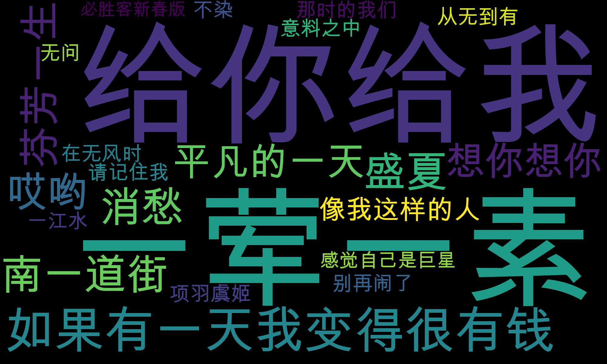

[TOC]

#词云展示

词云也叫文字云，用来统计文本中高频出现的词，顾虑掉某些常用词，将文本中的重要关键词进行可视化。Python提供的词云工具WordCloud。

## **词云创建**

```python
WordCloud()
```

部分函数参数含义：

background_color:设置背景颜色

mask:设置背景图片

font_path:设置字体，针对中文的情况需要设置中文字体，否则显示乱码

max_words:设置最大字数

stopwords:设置停用词

max_font_size:设置字体最大值

width:设置画布宽度

height:设置画布高度

random_state:设置多少种随机状态，即多少种颜色

generate() ：生成词云

tofile()：保存为图片格式

## **目录标题可视化实践**

```python
from wordcloud import WordCloud
import matplotlib.pyplot as plt
import jieba
from PIL import Image
import numpy as  np

path =  '/Users/apple/Desktop/GitHubProject/Read mark/数据分析/geekTime/data/'
#生成词云
def create_word_cloud(f):
    text = " ".join(jieba.cut(f,cut_all=False, HMM=True))
    wc = WordCloud(
        font_path= '/Library/Fonts/Arial Unicode.ttf',
        max_words = 100,
        width = 2000,
        height= 1200
    )
    wordcloud = wc.generate(text)
    #写词云图片
    wordcloud.to_file(path + 'wordcloud.jpg')
    #显示词云图片
    plt.imshow(wordcloud)
    plt.axis("off")
    plt.show()

#去掉停用词
def remove_stop_words(f):
    stop_words = ['学会','就是','什么']
    for stop_word in  stop_words:
        f = f.replace(stop_word,'')
    return f


f = '数据分析全景图及修炼指南\
学习数据挖掘的最佳学习路径是什么\
Python 基础语法：开始你的Python之旅\
Python 科学计算：Numpy\
Python 科学计算：Pandas\
学习数据分析要掌握哪些基本概念\
用户画像：标签化就是数据的抽象能力\
数据采集：如何自动化采集数据\
数据采集：如何用八爪鱼采集微博上的"D&G"评论\
Python爬虫：如何自动化下载王祖贤海报？\
数据清洗：数据科学家%80时间都花费在来这里？\
数据集成： 这些大号一共20亿粉丝？\
数据变换 大学成绩要求正态分布合理么？\
数据可视化：掌握数据领域的万金油技能\
一次学会Python数据可视化的10种技能'

f = remove_stop_words(f)
create_word_cloud(f)
```

输出结果：


## **毛不易歌词词云实践**

```python
# -*- coding: utf-8 -*-
import requests
import sys
import re
import os
import jieba
import numpy as  np
import matplotlib.pyplot as plt
from wordcloud import WordCloud
from PIL import Image
from lxml import etree

headers = {
    'Referer':'http://music.163.com',
    'Host':'music.163.com',
    'Accept':'text/html,application/xhtml+xml,application/xml;q=0.9,image/Webp,image/apng,*/*;q=0.8',
    'User-Agent':'Chrome/10'
}

#得到某一首歌的歌词
def get_song_lyric(headers,lyric_url):
    res = requests.request('GET', lyric_url,headers=headers)
    if 'lrc' in res.json():
        lyric = res.json()['lrc']['lyric']
        new_lyric = re.sub(r'[\d:.[\]]','',lyric)
        return new_lyric
    else:
        return ''
        print(res.json())

#去掉停用词
def remove_stop_words(words):
    stop_words = ['作词', '作曲', '编曲', 'Arranger', '录音', '混音', '人声', 'Vocal', '弦乐', 'Keyboard', '键盘', '编辑', '助理', 'Assistants', 'Mixing', 'Editing', 'Recording', '音乐', '制作', 'Producer', '发行', 'produced', 'and', 'distributed']
    for stop_word in stop_words:
        words = words.replace(stop_word,'')
    return words

path =  '/Users/apple/Desktop/GitHubProject/Read mark/数据分析/geekTime/data/'
#生成词云
def create_word_cloud(text):
    text = remove_stop_words(text)
    cut_text = " ".join(jieba.cut(text,cut_all=False,HMM=True))
    wc = WordCloud(
        font_path= "/Library/Fonts/Arial Unicode.ttf",
        max_words = 100,
        width=2000,
        height=1200
    )
    wordcloud = wc.generate(cut_text)
    wordcloud.to_file(path + '毛不易歌词词云.jpg')
    plt.imshow(wordcloud)
    plt.axis('off')
    plt.show()

#得到指定歌手页面 热门前50的歌曲 ID，歌曲名
def get_songs(artist_id):
    page_url = 'https://music.163.com/artist?id=' + artist_id
    #获取网页HTML
    res = requests.request('GET',page_url,headers=headers)
    #用XPath解析前50首热门歌曲
    html = etree.HTML(res.text)
    href_xpath = "//*[@id='hotsong-list']//a/@href"
    name_xpath = "//*[@id='hotsong-list']//a/text()"
    hrefs = html.xpath(href_xpath)
    names = html.xpath(name_xpath)
    #设置热门歌曲的Id，歌曲名称
    song_ids = []
    song_names = []
    for href,name in zip(hrefs,names):
        song_ids.append(href[9:])
        song_names.append(name)
    return song_ids,song_names

#设置歌手ID，
artist_id = '12138269'
[song_ids,song_names] = get_songs(artist_id)
#所有歌词
all_word =''
#获取每首歌歌词
for (song_id,song_name) in zip(song_ids,song_names):
    #歌词API url
    lyric_url = 'http://music.163.com/api/song/lyric?os=pc&id=' + song_id + '&lv=-1&kv=-1&tv=-1'
    lyric = get_song_lyric(headers,lyric_url)
    all_word = all_word + '' + lyric
    print(song_name)

#格局词频 生成词云
create_word_cloud(all_word)
```

输出结果

```python
像我这样的人
不染
消愁
别再闹了
借
无问
给你给我
平凡的一天
从无到有
一荤一素
盛夏
想你想你
如果有一天我变得很有钱
哎哟
项羽虞姬
感觉自己是巨星
芬芳一生
南一道街
那时的我们
在无风时
一江水
请记住我
意料之中
Bonus Track：一荤一素 (Demo版)
Bonus Track：给你给我 (Demo版)
Remember Me (Mao Bu Yi Version)
牧马城市
梅香如故
浴火成诗
一半 (Live)
二零三
一程山路
月下独酌 (Live)
下雨了 (Live)
故乡游 (Live)
深夜一角
南一道街_North Hollywood (Live)
南一道街 North Hollywood
Imagine (Live)
青春 (Live)
等
明天的孩子们
模特 (Live)
像我这样的人 + 一程山路 (Live)
很多事要唱 (Live)
一生所爱 (Live)
我要你 (Live)
渡情 (Live)
大喊大叫的流行歌 (Live)
203 + 感觉自己是巨星 (Live)
```


##**习题：给歌单创建词云**

```python
import requests
import jieba
import matplotlib.pyplot as plt
from wordcloud import WordCloud

#创建请求头
headers = {
    'Referer':'http://music.163.com',
    'Host':'music.163.com',
    'Accept':'text/html,application/xhtml+xml,application/xml;q=0.9,image/Webp,image/apng,*/*;q=0.8',
    'User-Agent':'Chrome/10'
}

#获取歌单
def get_song_name(req_url):
    res = requests.request('GET',req_url,headers=headers)
    if 'tracks' in res.json()['result']:
        tracks = res.json()['result']['tracks']
        names = []
        for i in  range(len(tracks)):
            name = tracks[i]['name']
            names.append(name)
        return names
    else:
        return ''

#过滤停用词
def remove_stop_words(text):
    stop_words = ['(伴奏)','Bonus Track：','(Demo版)']
    for stop_word in stop_words:
        text = text.replace(stop_word,'')
    return text

path = '/Users/apple/Desktop/GitHubProject/Read mark/数据分析/geekTime/data/'
#获得词云
def create_wordcloud(text):
    #移除过滤词
    text = remove_stop_words(text)
    wc = WordCloud(
        font_path = "/Library/Fonts/Arial Unicode.ttf",
        max_words = 100,
        width = 2000,
        height = 1200
    )
    wordcloud = wc.generate(text)
    wordcloud.to_file(path + 'wordcloud_homework.jpg')
    plt.imshow(wordcloud)
    plt.axis('off')
    plt.show()

#处理歌单，形成词云
request_url = 'http://music.163.com/api/playlist/detail?id=753776811'
content_list = get_song_name(request_url)
content = " ".join(content_list)
print('歌单信息---',content)
create_wordcloud(content)
```

输出结果：

```python
歌单信息--- 别再闹了 在无风时 那时的我们 从无到有 一江水 借 消愁 不染 盛夏 哎哟 无问 一荤一素 南一道街 芬芳一生 请记住我 项羽虞姬 给你给我 想你想你 意料之中 平凡的一天 像我这样的人 感觉自己是巨星 如果有一天我变得很有钱 借 (伴奏) 消愁 (伴奏) 盛夏 (伴奏) 哎哟 (伴奏) 想你想你 (伴奏) 南一道街 (伴奏) 给你给我 (伴奏) 芬芳一生 (伴奏) 一荤一素 (伴奏) 平凡的一天 (伴奏) 像我这样的人 (伴奏) 如果有一天我变得很有钱 (伴奏) 如果有一天我变得很有钱 (必胜客新春版) Bonus Track：一荤一素 (Demo版) Bonus Track：给你给我 (Demo版)
```



