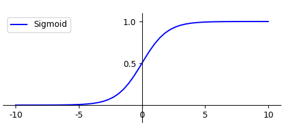
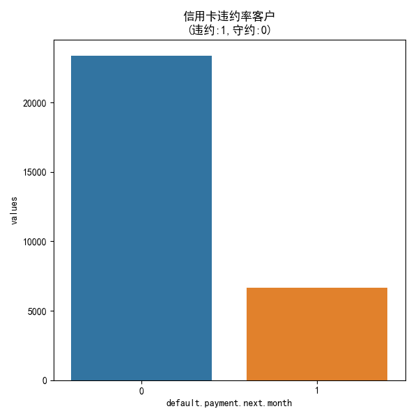
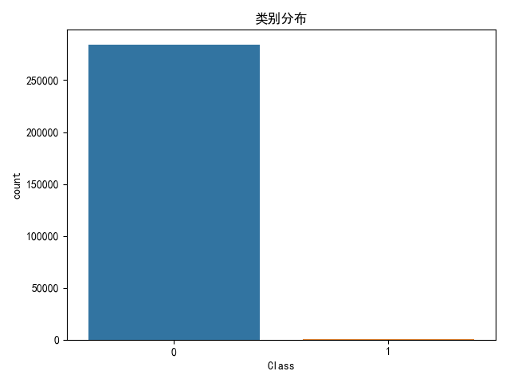
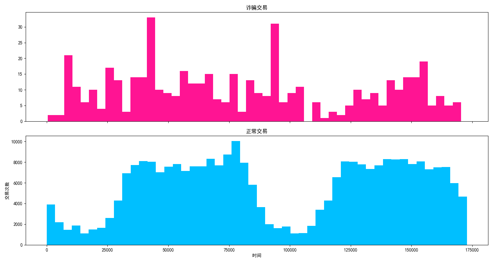
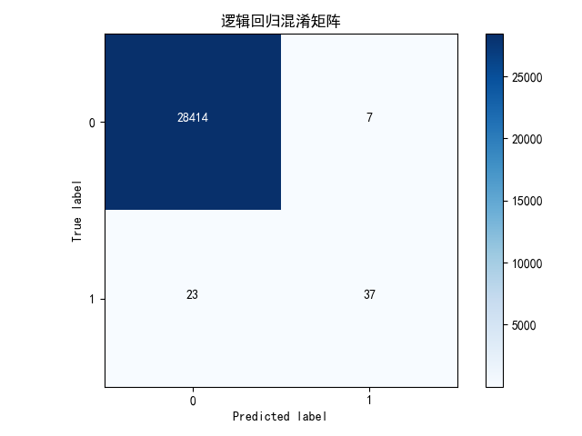
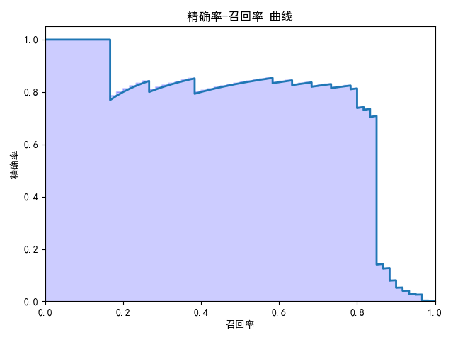

[TOC]

#数据挖掘-信用卡违约&诈骗分析

数据挖掘两个核心问题：

1.如何选择各种分类器

2.如何优化分类器的参数得到更好的分类准确率

其它问题：

1.掌握数据探索核数据可视化的方式

2.对数据的完整性和质量做评估

##**随机森林分类器**

十大算法之外的随机森林分类器也是常用的分类器。

随机森林：Random Forest，英文简写RF，是一个包含多个决策树的分类器，每一个子分类器都是一个CART分类回归树。因此随机森林既可以做分类，又可以做回归。当它做分类的时候，输出的结果是每个子分类器的分类结果中最多的那个。数据集成模式中的投票模式，这点正好与AdaBoost分类器相反。若是做回归，输出的结果是每棵CART树的回归结果的平均值。

sklearn中，使用RandomForestClassifier() 构造随机森林模型

构造参数含义：

1.n_estimators: 随机森林里决策树的个数，默认是10

2.criterion：决策树分裂标准，默认基尼系数

3.max_depth: 决策树的最大深度，默认是None，即不限制决策树的深度。。

4.n_jobs 拟合核预测的时候CPU核数，默认是1

## **逻辑回归（Logistic 回归）分类器**

逻辑回归，logistic回归，是分类方法，主要解决二分类问题。逻辑回归中使用Logistic函数，也称为Sigmoid函数（深度学习中常用的函数之一）。

函数公式为：

​					$g(z) = \dfrac{1}{1+e^{-z}}$

函数图形如下所示



g(z)的结果在0—1之间，当z越大的时候，g(z)越大，当z趋近于无穷大的时候，g(z)趋近于1。当z趋近于无穷小的时候，g(z)趋近于0。

要实现一个二分类任务，0即为不发生，1即为发生。给定一些历史数据X和y。其中x代表样本的n个特征，y代表正例和负例，也就是0或1的取值。通过历史样本的学习，可以得到一个模型，当给定新的x的时候，可以预测出y。y是一个预测的概率，通常不是0%和100%，而是中间的取值，那么可以认为概率大于50%的时候，即为发生(正例)，概率小于50%的时候，即为不发生(负例)，这就完成来二分类预测。

sklearn中，LogisticRegression()构建回归分类器。

构造参数含义：

1.penalty: 惩罚项，取值为l1或l2，默认为l2。当模型参数满足高斯分布的时候，使用l2，当参数模型满足拉普拉斯分布的时候，使用l1。

2. solver：代表的是逻辑回归损失函数的优化方法。有5个参数可选，分别为liblinear、lbfgs、newton-cg、sag和saga。默认为liblinear，适用于数据量小的数据集，当数据集量大的时候可以用sag或saga方法。
3. max_iter：算法收敛的最大迭代次数，默认为10 。
4. n_jobs: 拟合核预测的时候CPU的核数，默认是1，也就是整数，如果是-1则代表CPU的核数。

##**分类器参数调优工具-GirdSearchCV**

GirdSearchCV是Python的参数自动搜索模块，用来解决调节构造参数，或其取值范围，以便达到更好的分类效果。

构造函数GirdSearchCV()

构造参数含义：

1.estimator：要采用的分类器，如随机森林、决策树、SVM等

2.param_grid:要优化的参数及取值，以字典或列表的形式输入

3.cv:交叉验证的折数，默认为None，代表使用三折交叉验证

4.scoring: 准确度的评价标准，默认为None，也就是需要使用score函数，可以设置评价标准，比如accuray，f1等。

```py
# -*- coding: utf-8 -*-
#利用GirdSearchCV寻找最优参数
from sklearn.ensemble import RandomForestClassifier
from sklearn.model_selection import GridSearchCV
from sklearn.datasets import load_iris
rf = RandomForestClassifier()
parameters = {"n_estimators":range(1,11)}
iris = load_iris()
#使用GridSearchCV进行参数调优
clf = GridSearchCV(estimator=rf,param_grid=parameters)
#对iris数据集进行分类
clf.fit(iris.data, iris.target)
print("最优分数: %.4lf" %clf.best_score_)
print("最优参数: ",clf.best_params_)
```

输出结果：

```python
最优分数: 0.9667
最优参数:  {'n_estimators': 3}
```

## **数据规分类-Pipeline管道机制流水线作业**

数据分类是有步骤的，先对数据进行规范化处理，可以采用PCA方法(一种常用的降维方法) 对数据降维，最后使用分类器分类。但Python中有一种Pipeline管道机制。让每一步都按照顺序执行，从而创建Pipeline流水线作业，每一步采用(名称，步骤)的方式来表示

以下实例，先采用StandardScaler方法对数据规范化，即才用数据规范化为均值为0，方差为1的正态分布，然后采用PCA方法对数据进行降维，最后采用随机森林进行分类。

```python
# -*- coding: utf-8 -*-
#利用GridSearchCV寻找最优参数，使用Pipeline进行流水作业
from sklearn.ensemble import RandomForestClassifier
from sklearn.datasets import load_iris
from sklearn.model_selection import GridSearchCV
from sklearn.preprocessing import StandardScaler
from sklearn.pipeline import Pipeline
#
rf = RandomForestClassifier()
parameters = {"randomforestclassifier__n_estimators": range(1,11)}
iris = load_iris()
pipeline = Pipeline([
        ('scaler', StandardScaler()),
        ('randomforestclassifier', rf)
])
#使用GridSearchCV进行参数调优
clf = GridSearchCV(estimator=pipeline, param_grid=parameters)
# #对iris数据集进行分类
clf.fit(iris.data,iris.target)
print("最优分数: %.4lf" %clf.best_score_)
print("最优参数：",clf.best_params_)
```

输出结果：

```python
最优分数: 0.9667
最优参数： {'randomforestclassifier__n_estimators': 8}
```

## **模型评估指标**

对模型评估，一般采用准确率(accuracy),它指的是分类器正确分类的样本数与总体样本数之间的比例。该指标对大部分的分类情况有效，不过当分类结果严重不平衡的时候，准确率很难反应模型的好坏。

数据预测四种情况：TP、FP、TN、FN

1. TP：预测为正，判断正确

2. FP：预测为正，判断错误

3. TN：预测为负，判断正确

4. FN：预测为负，判断错误         

   样本总数 = TP+FP+TN+FN,预测正确的样本数为TP+TN

   准确率$Accuracy = \dfrac{TP+TN}{TP+TN+FN+FP}$

   而针对分类不平衡的情况，**精确度**和**召回率** 是两个重要指标。

   精确度 $P=\dfrac{TP}{TP+FP} $

   召回率,也称为查全率 $R=\dfrac{TP}{TP+FN}$

   但是，以上两个重要的指标，单纯判断其中任何一个都可能会存在严重的误差，有一个指标综合来精确率和召回率，可以更好的评估模型的好坏。这个指标叫做F1

   用公式表示为：

   ​						$F1 = 2 \times \dfrac{P\times R}{P+R}$

   F1作为精确率P和召回率R的调和平均值，数值越大代表模型的结果越好。

## **对信用卡违约率进行分析**

```python
# -*- coding: utf-8 -*-
import pandas as pd
from sklearn.model_selection import learning_curve
from sklearn.model_selection import train_test_split
from sklearn.model_selection import GridSearchCV
from sklearn.preprocessing import StandardScaler
from sklearn.pipeline import Pipeline
from sklearn.metrics import accuracy_score
from sklearn.svm import SVC
from sklearn.tree import DecisionTreeClassifier
from sklearn.ensemble import RandomForestClassifier
from sklearn.neighbors import KNeighborsClassifier
from matplotlib import pyplot as plt
import seaborn as sns
from sklearn.ensemble import AdaBoostClassifier

path = '/Users/apple/Desktop/GitHubProject/Read mark/数据分析/geekTime/data/'
#数据加载
data = pd.read_csv(path + 'UCI_Credit_Card.csv')
print(data.shape) #查看数据集大小
print(data.describe()) #查看数据集概览
next_month = data['default.payment.next.month'].value_counts()
print(next_month) #查看下一个月违约率的情况

df = pd.DataFrame({'default.payment.next.month':next_month.index, 'values':next_month.values})
plt.rcParams['font.sans-serif']=['SimHei']
plt.figure(figsize=(6,6))
plt.title('信用卡违约率客户\n(违约:1,守约:0)')
sns.set_color_codes("pastel")
sns.barplot(x= 'default.payment.next.month', y="values",data=df)
locs, labels = plt.xticks()
plt.show()

#特征选择，去掉ID字段，最后一个字段
data.drop(['ID'],inplace=True,axis=1)
targits = data['default.payment.next.month'].values
columns = data.columns.tolist()
columns.remove('default.payment.next.month')
features = data[columns].values
#30%作为测试集，其余作为训练集
train_features,test_features,train_targit,test_targit = train_test_split(features,targits,test_size=0.30,stratify=targits,random_state=1)

#构造分类器
classifiers = [
    SVC(random_state=1,kernel='rbf'),
    DecisionTreeClassifier(random_state=1,criterion='gini'),
    RandomForestClassifier(random_state=1,criterion='gini'),
    KNeighborsClassifier(metric= 'minkowski'),
    AdaBoostClassifier(random_state=1)
]

#分类器名称
classifier_name = [
    'svc',
    'decisiontreeclassifier',
    'randomforestclassifier',
    'kneighborsclassifier',
    'adaboostclassifier'
]
#分类器参数
classifier_param_grid = [
    {'svc__C': [1], 'svc__gamma': [0.01]},
    {'decisiontreeclassifier__max_depth': [6, 9, 11]},
    {'randomforestclassifier__n_estimators': [3, 5, 6]},
    {'kneighborsclassifier__n_neighbors': [4, 6, 8]},
    {'adaboostclassifier__n_estimators':[10,50,100]}
]

#对具体的分类器进行GridSearchCV参数调优
def GridSearchCV_work(pipeline,train_features,train_targits,test_features,test_targits,param_grid,score='accuracy'):
    response = {}
    gridsearch = GridSearchCV(estimator=pipeline,param_grid=param_grid,scoring=score)
    #寻找最优的参数核最优的准确率分数
    search = gridsearch.fit(train_features,train_targits)
    print("Gridsearch 最优参数:",search.best_params_)
    print("Gridsearch 最优分数: %0.4lf" %search.best_score_)
    predict = gridsearch.predict(test_features)
    print("准确率 %.4lf" %accuracy_score(test_targits,predict))
    response['predict'] = predict
    response['accuracy_score'] = accuracy_score(test_targits,predict)
    return response

for model, model_name, mode_param_grid in zip(classifiers,classifier_name,classifier_param_grid):
    pipeline = Pipeline([
        ('scaler', StandardScaler()),
        (model_name, model)
    ])

    result = GridSearchCV_work(pipeline,train_features,train_targit,test_features,test_targit,mode_param_grid,score='accuracy')
```

输出结果：



```python
(30000, 25)
                 ID       LIMIT_BAL  ...       PAY_AMT6  default.payment.next.month
count  30000.000000    30000.000000  ...   30000.000000                30000.000000
mean   15000.500000   167484.322667  ...    5215.502567                    0.221200
std     8660.398374   129747.661567  ...   17777.465775                    0.415062
min        1.000000    10000.000000  ...       0.000000                    0.000000
25%     7500.750000    50000.000000  ...     117.750000                    0.000000
50%    15000.500000   140000.000000  ...    1500.000000                    0.000000
75%    22500.250000   240000.000000  ...    4000.000000                    0.000000
max    30000.000000  1000000.000000  ...  528666.000000                    1.000000

[8 rows x 25 columns]
0    23364
1     6636
Gridsearch 最优参数: {'svc__C': 1, 'svc__gamma': 0.01}
Gridsearch 最优分数: 0.8174
准确率 0.8172

Gridsearch 最优参数: {'decisiontreeclassifier__max_depth': 6}
  Gridsearch 最优分数: 0.8186
准确率 0.8113

Gridsearch 最优参数: {'randomforestclassifier__n_estimators': 6}
Gridsearch 最优分数: 0.7998
准确率 0.7994

Gridsearch 最优参数: {'kneighborsclassifier__n_neighbors': 8}
Gridsearch 最优分数: 0.8040
准确率 0.8036

Gridsearch 最优参数: {'adaboostclassifier__n_estimators': 10}
Gridsearch 最优分数: 0.8187
准确率 0.8129
```

##**对信用卡诈骗进行分析**

```python
# -*- coding: utf-8 -*-
import pandas as pd
import numpy as np
import seaborn as sns
import matplotlib.pyplot as plt
import itertools
from sklearn.linear_model import LogisticRegression
from sklearn.model_selection import train_test_split
from sklearn.metrics import confusion_matrix,precision_recall_curve
from sklearn.preprocessing import StandardScaler
import warnings

warnings.filterwarnings('ignore')

#混淆矩阵可视化
def plot_confusion_matrix(cm,classes,normalize=False,
                          title='Confusion matrix',cmap=plt.cm.Blues):
    plt.figure()
    plt.imshow(cm, interpolation= 'nearest', cmap=cmap)
    plt.title(title)
    plt.colorbar()
    tick_marks = np.arange(len(classes))
    plt.xticks(tick_marks,classes,rotation=0)
    plt.yticks(tick_marks,classes)

    thresh = cm.max()/2
    for i,j in itertools.product(range(cm.shape[0]),range(cm.shape[1])):
        plt.text(j,i,cm[i,j],
                 horizontalalignment = 'center',
                 color = 'white' if cm[i,j] > thresh else 'black')
    plt.tight_layout()
    plt.ylabel('True label')
    plt.xlabel('Predicted label')
    plt.show()

#显示模型评估结果
def show_metrics():
    tp = cm[1,1]
    fn = cm[1,0]
    fp = cm[0,1]
    tn = cm[0,0]
    P = tp/(tp+fp)
    R = tp/(tp+fn)
    F1 = 2 *((P*R)/(P+R))
    print('精确率:{:.3f}'.format(P))
    print('召回率:{:.3f}'.format(R))
    print('F1值:{:.3f}'.format(F1))

#绘制精确率-召回率曲线图
def plot_precision_recall():
    plt.step(recall,precision,color='b',alpha = 0.2,where='post')
    plt.fill_between(recall,precision,step='post',alpha=0.2,color='b')
    plt.plot(recall,precision,linewidth=2)
    plt.xlim([0.0,1])
    plt.ylim([0.0,1.05])
    plt.xlabel('召回率')
    plt.ylabel('精确率')
    plt.title('精确率-召回率 曲线')
    plt.show()

#数据加载
path = '/Users/apple/Desktop/GitHubProject/Read mark/数据分析/geekTime/data/'

data = pd.read_csv(path + 'creditcard.csv')
#数据探索
print(data.describe())
#设置plt正确显示中文
plt.rcParams['font.sans-serif'] = ['SimHei']
#绘制类别分布
plt.figure()
ax = sns.countplot(x = 'Class', data= data)
plt.title('类别分布')
plt.show()

#显示交易笔数，欺诈交易笔数
num = len(data)
num_fraud = len(data[data['Class']==1])
print('总交易笔数：',num)
print('诈骗交易笔数：',num_fraud)
print('诈骗交易比例：{:.6f}'.format(num_fraud/num))

#欺诈和正常交易可视化
f,(ax1,ax2) = plt.subplots(2,1,sharex = True,figsize=(15,8))
bins = 50
ax1.hist(data.Time[data.Class == 1],bins = bins,color = 'deeppink')
ax1.set_title('诈骗交易')
ax2.hist(data.Time[data.Class == 0],bins=bins,color='deepskyblue')
ax2.set_title('正常交易')
plt.xlabel('时间')
plt.ylabel('交易次数')
plt.show()

#对Amount进行数据规范化
data['Amount_Norm'] = StandardScaler().fit_transform(data['Amount'].values.reshape(-1,1))

#特征选择
y = np.array(data.Class.tolist())
data = data.drop(['Time','Amount','Class'],axis=1)
X = np.array(data.as_matrix())

#准备训练集核测试集
train_x, test_x, train_y,test_y = train_test_split(X,y,test_size=0.1,random_state=33)

#逻辑回归分类
clf = LogisticRegression()
clf.fit(train_x,train_y)
predict_y = clf.predict(test_x)
#预测样本的置信分数
score_y = clf.decision_function(test_x)
#计算混淆矩阵并显示
cm = confusion_matrix(test_y,predict_y)
class_names = [0,1]
#显示混淆矩阵
plot_confusion_matrix(cm,classes=class_names,title='逻辑回归混淆矩阵')

#显示模型评估分数
show_metrics()
#计算精确率、召回率、阈值用于可视化
precision,recall,thresholds = precision_recall_curve(test_y,score_y)
plot_precision_recall()
```

输出结果:



```python
               Time            V1  ...         Amount          Class
count  284807.000000  2.848070e+05  ...  284807.000000  284807.000000
mean    94813.859575  1.165980e-15  ...      88.349619       0.001727
std     47488.145955  1.958696e+00  ...     250.120109       0.041527
min         0.000000 -5.640751e+01  ...       0.000000       0.000000
25%     54201.500000 -9.203734e-01  ...       5.600000       0.000000
50%     84692.000000  1.810880e-02  ...      22.000000       0.000000
75%    139320.500000  1.315642e+00  ...      77.165000       0.000000
max    172792.000000  2.454930e+00  ...   25691.160000       1.000000

[8 rows x 31 columns]
总交易笔数： 284807
诈骗交易笔数： 492
诈骗交易比例：0.001727
```





```python
精确率:0.841
召回率:0.617
F1值:0.712
```



