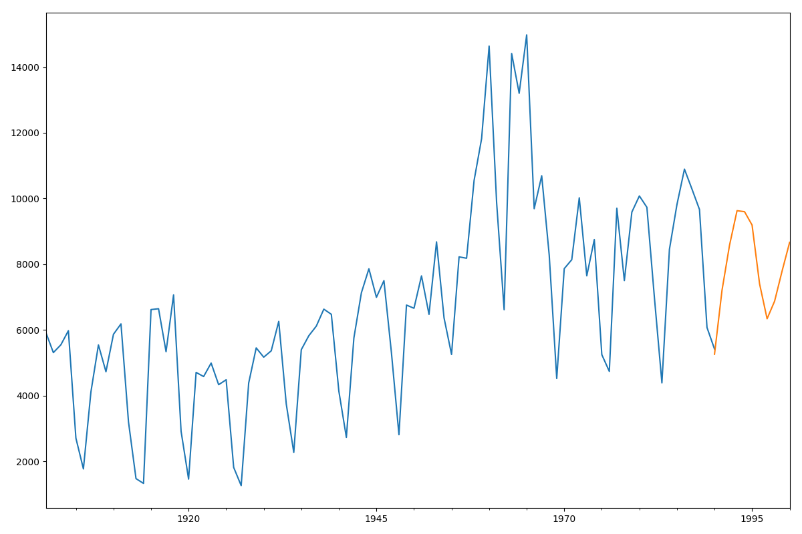
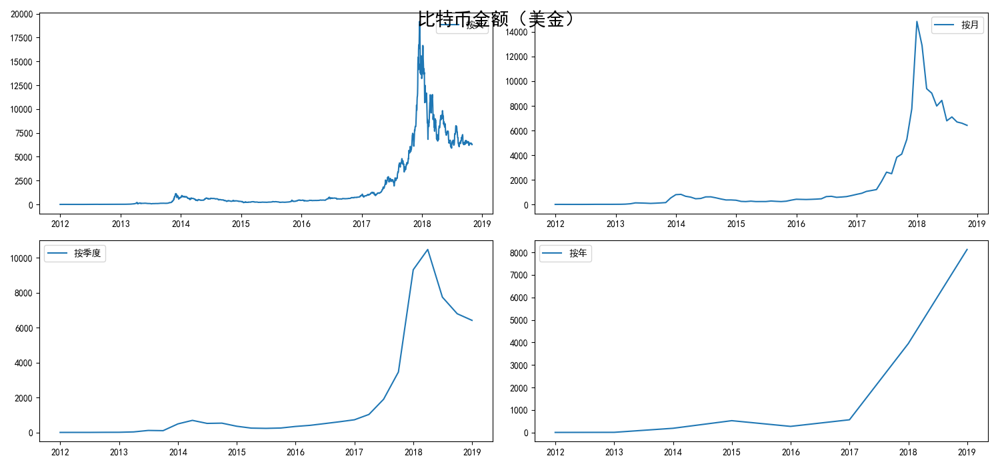
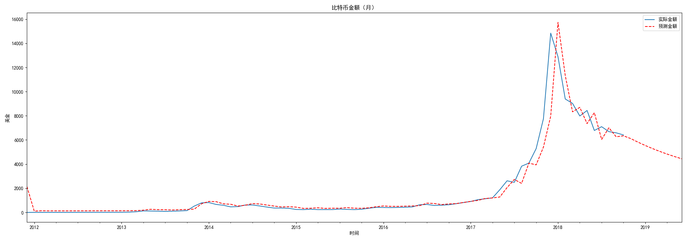
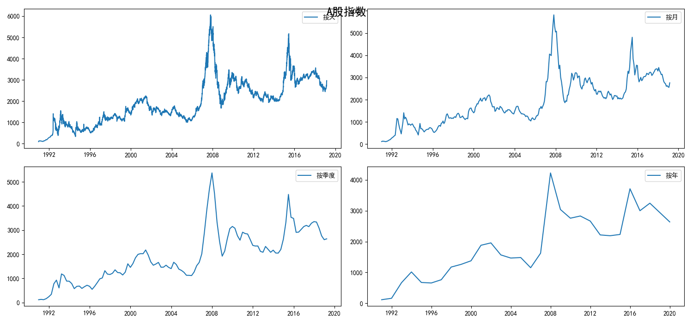
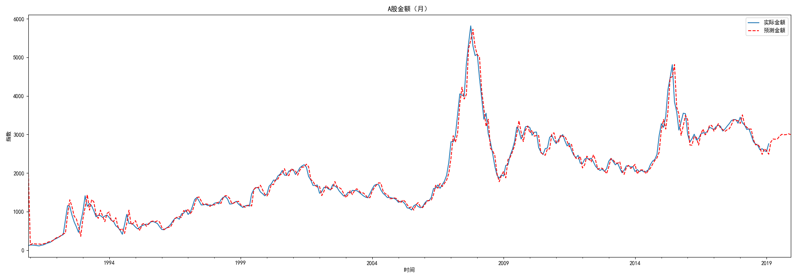

[TOC]

# 数据挖掘-基于时间序列分析算法

时间序列分析得到的是目标变量y与时间的相关性。时间序列分析建立在时间变化的基础上，分析目标变量的趋势、周期、时期和不稳定因素等。而回归分析擅长的是多变量与目标结果之间的分析，得到的是目标变量y与自变量x(一个或多个)的相关性。

基于时间序列分析的模型建立来观察结果与时间变化的关系，能预测未来一段时间内的结果变化情况。

##**时间序列模型**

时间序列预测模型中，经典的模型包括AR、MA、ARMA、ARIMA等

**AR**：Auto Regressive，自回归模型。过去若干时刻的点通过线性组合，再加上白噪声可以预测未来某个时刻的点。AR模型存在一个阶数，称为AR(p)模型，也叫做p阶自回归模型。指的是通过这个时刻点的前p个点，通过线性组合再加上白噪声来预测当前时刻点的值。

**MA**：Moving Average，滑动平均模型。通过历史白噪声进行线性组合来影响当前时刻点。MA模型也存在一个阶数，称为MA(q)模型，也叫做q阶移动平均模型。

**ARMA**：Auto Regressive Moving Average，自回归滑动平均模型。相比AR和MA模型，其准确率更高。ARMA模型存在p和q两个阶数，称为ARMA(p，q)模型。

**ARIMA**：Auto Regressive Integrated Moving Average 模型，差分自回归滑动平均模型，也叫求合自回归滑动平均模型。ARIMA比ARMA多来一个差分的过程，作用是对不平稳数据进行查分平稳，在差分平稳后再进行建模。ARIMA是一个三元组的阶数p，d，q），称为ARIMA(p，d，q)模型，d是差分阶数。

## **ARMA模型创建**

```python
# -*- coding: utf-8 -*-
#用ARMA进行时间序列预测
import pandas as pd
import matplotlib.pyplot as plt
import statsmodels.api as sm
from statsmodels.tsa.arima_model import ARMA
from statsmodels.graphics.api import qqplot

#创建数据
data = [5922, 5308, 5546, 5975, 2704, 1767, 4111, 5542, 4726, 5866, 6183, 3199, 1471, 1325, 6618, 6644, 5337, 7064, 2912, 1456, 4705, 4579, 4990, 4331, 4481, 1813, 1258, 4383, 5451, 5169, 5362, 6259, 3743, 2268, 5397, 5821, 6115, 6631, 6474, 4134, 2728, 5753, 7130, 7860, 6991, 7499, 5301, 2808, 6755, 6658, 7644, 6472, 8680, 6366, 5252, 8223, 8181, 10548, 11823, 14640, 9873, 6613, 14415, 13204, 14982, 9690, 10693, 8276, 4519, 7865, 8137, 10022, 7646, 8749, 5246, 4736, 9705, 7501, 9587, 10078, 9732, 6986, 4385, 8451, 9815, 10894, 10287, 9666, 6072, 5418]
data = pd.Series(data)
data_index = sm.tsa.datetools.dates_from_range('1901','1990')
#绘制数据图
data.index = pd.Index(data_index)
data.plot(figsize=(12,8))
plt.show()

#创建ARMA模型
arma = ARMA(data,(7,0)).fit()
print('AIC: %.4lf' %arma.aic)
#模型预测
predict = arma.predict('1990','2000')
#预测结果绘制
fig,ax = plt.subplots(figsize=(12,8))
ax = data.ix['1901':].plot(ax=ax)
predict.plot(ax=ax)
plt.show()
```

输出结果：

```python
AIC: 1619.6323
```



**AIC准则**：

判断一个模型是否合适的准则是AIC准则，也叫作赤池消息准则，它是衡量统计模型拟合好坏的一个标准，数值越小代表模型拟合得越好。

## **基于时间序列分析预测比特币走势**

```python
# -*- coding: utf-8 -*-
import numpy as np
import pandas as pd
import matplotlib.pyplot as plt
from statsmodels.tsa.arima_model import ARMA
import warnings
from itertools import product
from datetime import datetime
warnings.filterwarnings('ignore')

#数据加载
path = '/Users/apple/Desktop/GitHubProject/Read mark/数据分析/geekTime/data/'
df = pd.read_csv(path + 'bitcoin_2012-01-01_to_2018-10-31.csv')
#将时间作为df的索引
df.Timestamp = pd.to_datetime(df.Timestamp)
df.index = df.Timestamp
# 数据探索
print(df.head())
# 按照月，季度，年来统计
df_month = df.resample('M').mean()
df_Q = df.resample('Q-DEC').mean()
df_year = df.resample('A-DEC').mean()
# 按照天，月，季度，年来显示比特币的走势
fig = plt.figure(figsize=[15, 7])
plt.rcParams['font.sans-serif']=['SimHei'] #用来正常显示中文标签
plt.suptitle('比特币金额（美金）', fontsize=20)
plt.subplot(221)
plt.plot(df.Weighted_Price, '-', label='按天')
plt.legend()
plt.subplot(222)
plt.plot(df_month.Weighted_Price, '-', label='按月')
plt.legend()
plt.subplot(223)
plt.plot(df_Q.Weighted_Price, '-', label='按季度')
plt.legend()
plt.subplot(224)
plt.plot(df_year.Weighted_Price, '-', label='按年')
plt.legend()
plt.show()

#设置参数范围
ps = range(0,3)
qs = range(0,3)
parameters = product(ps,qs)
parameters_list = list(parameters)
#寻找最优ARMA模型参数，即aic最小
results = []
best_aic = float("inf")
for param in parameters_list:
    try:
        model = ARMA(df_month.Weighted_Price,order=(param[0],param[1])).fit()
    except ValueError:
        print('参数错误:', param)
        continue
    aic = model.aic
    if aic < best_aic:
        best_model = model
        best_aic = aic
        best_param = param
    results.append([param,model.aic])

#输出最优模型
result_table = pd.DataFrame(results)
result_table.columns = ['parameters','aic']
print('最优模型：',best_model.summary())

#比特币预测
df_month2 = df_month[['Weighted_Price']]
date_list = [datetime(2018,11,30), datetime(2018, 12, 31), datetime(2019, 1, 31), datetime(2019, 2, 28), datetime(2019, 3, 31),
             datetime(2019, 4, 30), datetime(2019, 5, 31), datetime(2019, 6, 30)]
feature = pd.DataFrame(index=date_list, columns=df_month.columns)
df_month2 = pd.concat([df_month2, feature])
df_month2['forecast'] = best_model.predict(start=0,end=91)
#比特币预测结果显示
plt.figure(figsize=(20,7))
print(df_month2.head())
df_month2.Weighted_Price.plot(label='实际金额')
df_month2.forecast.plot(color='r',ls='--',label='预测金额')
plt.legend()
plt.title('比特币金额（月）')
plt.xlabel('时间')
plt.ylabel('美金')
plt.show()
```

输出结果:

```python
            Timestamp      Open  ...  Volume_(Currency)  Weighted_Price
Timestamp                        ...                                   
2011-12-31 2011-12-31  4.465000  ...         106.330084        4.471603
2012-01-01 2012-01-01  4.806667  ...          35.259720        4.806667
2012-01-02 2012-01-02  5.000000  ...          95.240000        5.000000
2012-01-03 2012-01-03  5.252500  ...          58.100651        5.252500
2012-01-04 2012-01-04  5.200000  ...          63.119578        5.208159

[5 rows x 8 columns]
```




```python
最优模型：                               ARMA Model Results                              
==============================================================================
Dep. Variable:         Weighted_Price   No. Observations:                   83
Model:                     ARMA(1, 1)   Log Likelihood                -688.761
Method:                       css-mle   S.D. of innovations            957.761
Date:                Fri, 26 Apr 2019   AIC                           1385.523
Time:                        00:25:34   BIC                           1395.198
Sample:                    12-31-2011   HQIC                          1389.410
                         - 10-31-2018                                         
========================================================================================
                           coef    std err          z      P>|z|      [0.025      0.975]
----------------------------------------------------------------------------------------
const                 2133.3881   1571.958      1.357      0.179    -947.592    5214.368
ar.L1.Weighted_Price     0.9252      0.042     22.031      0.000       0.843       1.008
ma.L1.Weighted_Price     0.2680      0.116      2.310      0.023       0.041       0.495
                                    Roots                                    
=============================================================================
                  Real          Imaginary           Modulus         Frequency
-----------------------------------------------------------------------------
AR.1            1.0808           +0.0000j            1.0808            0.0000
MA.1           -3.7313           +0.0000j            3.7313            0.5000
-----------------------------------------------------------------------------
```



##**A股预测**

```python
# -*- coding: utf-8 -*-
import numpy as np
import pandas as pd
import matplotlib.pyplot as plt
from statsmodels.tsa.arima_model import ARMA
from itertools import product
from datetime import datetime
import warnings
warnings.filterwarnings('ignore')

#数据加载
path = '/Users/apple/Desktop/GitHubProject/Read mark/数据分析/geekTime/data/'
df = pd.read_csv(path + 'shanghai_1990-12-19_to_2019-2-28.csv')
#将时间作为df的索引
df.Timestamp = pd.to_datetime(df.Timestamp)
df.index = df.Timestamp
#数据探索
print(df.head())
#按照月、季度、年来统计
df_month = df.resample('M').mean()
df_Q = df.resample('Q-DEC').mean()
df_year = df.resample('A-DEC').mean()
print(df_month.head())

#按照天、月、季度、年显示A股走势
fig = plt.figure(figsize=[15,7])
plt.rcParams['font.sans-serif']=['SimHei']
plt.suptitle('A股指数',fontsize = 18.0)
plt.subplot(221)
plt.plot(df.Price, '-', label='按天')
plt.legend()
plt.subplot(222)
plt.plot(df_month.Price, '-', label ='按月')
plt.legend()
plt.subplot(223)
plt.plot(df_Q.Price, '-', label='按季度')
plt.legend()
plt.subplot(224)
plt.plot(df_year.Price, '-', label='按年')
plt.legend()
plt.show()

#设置参数范围
ps = range(0,7)
qs = range(0,7)
parameters = product(ps,qs)
parameters_list = list(parameters)
#寻找最优ARMA模型参数，aic最小
results = []
best_aic = float("inf")
for param in parameters_list:
    try:
        model = ARMA(df_month.Price,order=(param[0],param[1])).fit()
    except ValueError:
        print('参数错误:',param)
        continue
    aic = model.aic
    if aic < best_aic:
        best_model = model
        best_aic=aic
        best_param = param
    results.append([param,model.aic])

#输出最优模型
result_table = pd.DataFrame(results)
result_table.columns = ['parameters','aic']
print('最佳模型:',best_model.summary())
#A股预测
df_month_value = df_month[['Price']]
date_list = [datetime(2019,3,31),datetime(2019,4,30),datetime(2019,5,31),
             datetime(2019,6,30),datetime(2019,7,31),datetime(2019,8,31),
             datetime(2019,9,30),datetime(2019,10,31),datetime(2019,11,30),
             datetime(2019,12,31)]
future = pd.DataFrame(index=date_list,columns=df_month.columns)
df_month_value = pd.concat([df_month_value,future])
df_month_value['forecast']=best_model.predict(start=0, end=348)
#A股预测结果展示
plt.figure(figsize=(20,7))
df_month_value.Price.plot(label='实际金额')
df_month_value.forecast.plot(color='r', ls='--', label='预测金额')
plt.legend()
plt.title('A股金额（月）')
plt.xlabel('时间')
plt.ylabel('指数')
plt.show()
```

输出结果：

```python
            Timestamp   Price
Timestamp                    
1990-12-19 1990-12-19   96.05
1990-12-20 1990-12-20  104.30
1990-12-21 1990-12-21  109.07
1990-12-24 1990-12-24  113.57
1990-12-25 1990-12-25  120.09
                 Price
Timestamp             
1990-12-31  116.285556
1991-01-31  132.367273
1991-02-28  131.877778
1991-03-31  126.002381
1991-04-30  118.459091
```




```python
参数错误: (6, 6)
最佳模型:                               ARMA Model Results                              
==============================================================================
Dep. Variable:                  Price   No. Observations:                  339
Model:                     ARMA(5, 4)   Log Likelihood               -2196.677
Method:                       css-mle   S.D. of innovations            156.571
Date:                Fri, 26 Apr 2019   AIC                           4415.354
Time:                        11:30:00   BIC                           4457.440
Sample:                    12-31-1990   HQIC                          4432.126
                         - 02-28-2019                                         
===============================================================================
                  coef    std err          z      P>|z|      [0.025      0.975]
-------------------------------------------------------------------------------
const        2203.8384    633.631      3.478      0.001     961.945    3445.732
ar.L1.Price     2.5625      0.104     24.596      0.000       2.358       2.767
ar.L2.Price    -2.8310      0.223    -12.703      0.000      -3.268      -2.394
ar.L3.Price     2.4662      0.315      7.832      0.000       1.849       3.083
ar.L4.Price    -1.8808      0.320     -5.871      0.000      -2.509      -1.253
ar.L5.Price     0.6789      0.113      6.005      0.000       0.457       0.901
ma.L1.Price    -1.2714      0.080    -15.852      0.000      -1.429      -1.114
ma.L2.Price     0.9239      0.109      8.507      0.000       0.711       1.137
ma.L3.Price    -1.0778      0.170     -6.331      0.000      -1.411      -0.744
ma.L4.Price     0.7077      0.094      7.565      0.000       0.524       0.891
                                    Roots                                    
=============================================================================
                  Real          Imaginary           Modulus         Frequency
-----------------------------------------------------------------------------
AR.1           -0.1383           -1.1234j            1.1319           -0.2695
AR.2           -0.1383           +1.1234j            1.1319            0.2695
AR.3            1.0115           -0.3158j            1.0596           -0.0482
AR.4            1.0115           +0.3158j            1.0596            0.0482
AR.5            1.0239           -0.0000j            1.0239           -0.0000
MA.1           -0.2619           -1.0558j            1.0878           -0.2887
MA.2           -0.2619           +1.0558j            1.0878            0.2887
MA.3            1.0234           -0.3832j            1.0928           -0.0570
MA.4            1.0234           +0.3832j            1.0928            0.0570
-----------------------------------------------------------------------------
```

