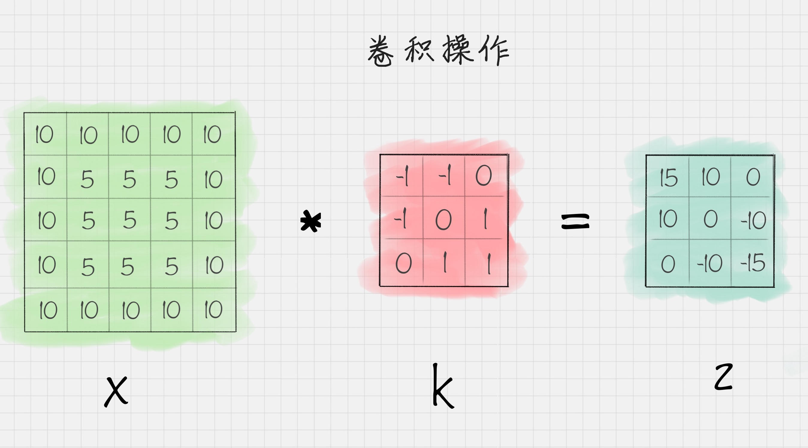
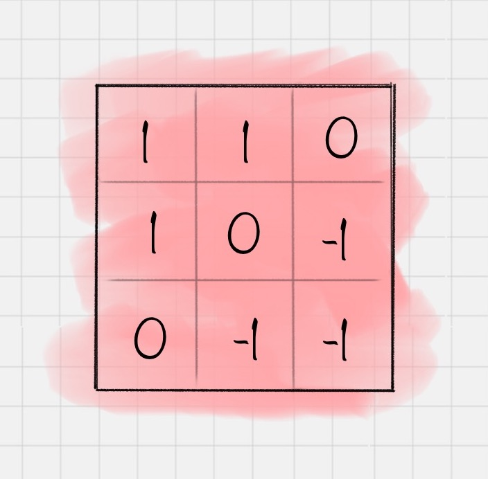
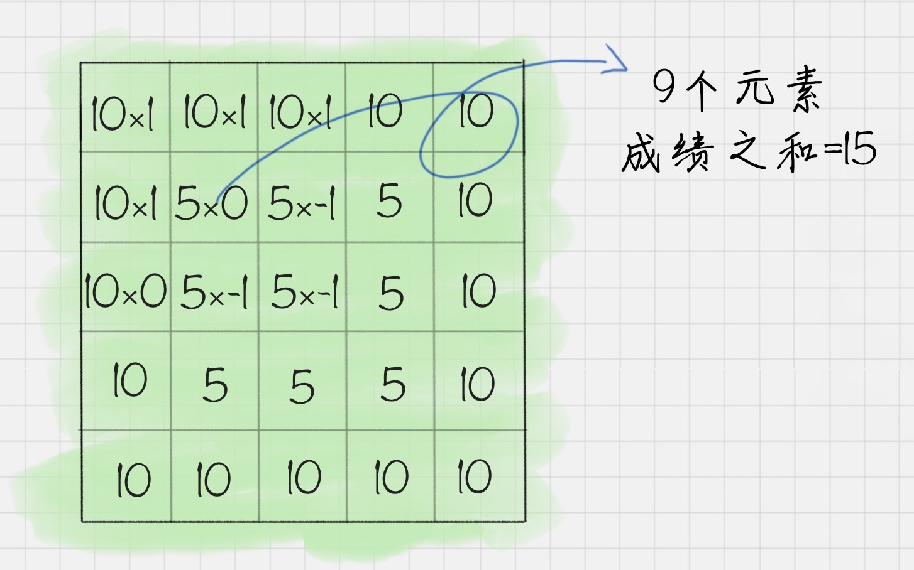
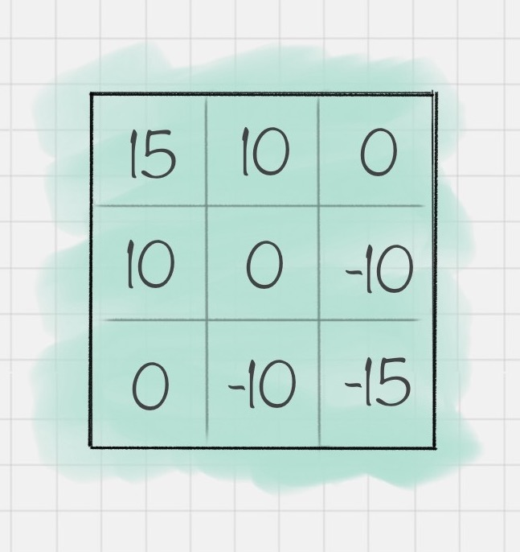

[TOC]

# 深度学习

深度学习属于机器学习的一种，目标同样是让机器具有智能，通过神经网络来实现。只需要告诉神经网络输入的数据是什么，输出是什么，深度学习会自己找到数据的特征规律。传统机器学习往往需要人工告诉机器采用什么样的模型算法，这是深度学习与传统机器学习最大的区别。

机器学习是人工智能一部分，指的是通过训练数据和算法模型让机器具有一定的智能。一般是通过已有的数据来学习知识，并通过各种算法模型形成一定的处理能力。当有新数据进来时，就可以通过训练好的模型对这些数据进行预测。

数据挖掘通常是从现有的数据中提取规律模式，以及使用算法模型。核心目的是找到这些数据变量之间的关系，因此会通过数据可视化对变量之间的关系进行呈现，用算法模型挖掘变量之间的关联关系。

## **神经网络工作原理**

**节点**：神经网络由神经元组成，称为节点，分布在神经网络的各个层中，这些层包括输入层、输出曾和隐藏层。

**输入层**：负责接收信号，并分发到隐藏层。一般将数据传给输入层。

**输出层**：负责输出结算结果，一般输出层节点数等于要分类的个数。

**隐藏层**：除了输入层和输出层外的神经网络都属于隐藏层，隐藏层可以是一层也可以是多层，每个隐藏层都会把前一层接点传输出来的数据进行计算。

**前向传播**：数据从输入层传递到输出曾的过程叫做前向传播。

**反向传播**：当前向传播作用到输出层得到分类结果之后，需要与实际值进行比对，从而得到误差。反向传播也叫作误差反向传播，核心原理是通过代价函数对网络中的参数进行修正，这样更容易让网络参数得到收敛。

**工作原理**：神经网络好比黑盒，只需要告诉这个黑盒子输入数据和输出数据，神经网络就可以自我训练。一旦训练好之后，可以像黑盒子一样使用，当传入一个新的数据时，会输出对应的输出结果。在训练过程中，神经网络主要是通过前向传播和反向传播机制运作。整个神经网络训练的过程就是不断的通过前向-反向传播迭代完成，当达到指定的迭代次数或者达到收敛标准的时候停止训练。然后拿训练好的网络模型对新的数据进行预测。

## **神经网络种类**

常用的神经网络结构，分别为**FNN**、**CNN**、**RNN**。

**FNN**：Fully-connected Neural Network，全连接神经网络。即每一层的神经元与上一层的所有神经元都是连接的。

**CNN**：卷积神经网络，广泛应用于图像处理，包括来卷积层、池化层和全连接层。

卷积层相当于一个滤镜作用，可以把图像进行分块，对每块图像进行变化操作。

池化层相当于神经元的数据进行降维处理，这样输出的维数就会减少很多，从而降低整体的计算量。

全连接层通常是输出曾的上一层，它将上一层神经元输出的数据转变成一维的向量。

**RNN**：循环神经网络，神经元的输出可以在下一个时刻作用到自身，RNN可以看做是在时间上传递的神经网络。可以应用在语音识别、自然语言处理等上下文相关的场景。

##**深度学习神经网络种类**

深度学习网络包括来FNN、CNN、RNN三种网络的变种形式，常用的神经网络包括：

**AlexNet**、**VGG19**、**GoogleNet**、**ResNet**等。


以上网络结构的提出与ILSVRC比赛相关，ILSVRC：Large Scale Visual Recognition Challenge。这是一个关于大规模图像可视化是别的比赛。Top-5正确率正是比赛的衡量指标之一。

## **深度学习应用领域**

深度学习有三大应用领域：

1.图像识别

2.语音识别

3.自然语言处理NLP

##**CNN网络**

### **CNN卷积操作**

卷积本身是一种矩阵运算。假设一个二维的图像X，和卷积K，把二维矩阵X进行卷积K操作之后，可以得到矩阵Z。



其中计算过程，也就是卷积的原理即：

第一步，需要将卷积核翻转180度，只有翻转之后才能做矩阵运算，也就是变成：



第二步，将卷积核的第一个元素，对准矩阵X左上角第一个元素，对应元素相乘，然后再相加，便得到卷积的第一个元素。



之后，将卷积的第一个元素，对准第一行第二个元素，同样对应的元素相乘，然后再相加，这样就得到来卷积矩阵的第二个元素。之后依次对准卷积核对应的位置，便能求出最后的卷积矩阵。



对应的代码为:

```python
# -*- coding utf-8 -*-
import pylab
import numpy as np
from scipy import signal

#设置源图像
img = np.array([[10,10,10,10,10],
               [10,5,5,5,10],
               [10,5,5,5,10],
               [10,5,5,5,10],
               [10,10,10,10,10]])
#设置卷积核
fil = np.array([[-1,-1,0],
               [-1,0,1],
               [0,1,1]])
#对原图像进行卷积操作
res = signal.convolve2d(img,fil,mode='valid')
print(res)
```

输出结果为：

```python
[[ 15  10   0]
 [ 10   0 -10]
 [  0 -10 -15]]
```

卷积操作是对图像进行了特征提取。实际上每个卷积核都是一种滤波器，它们把图像中符合条件的部分筛选出来，相当做了特征提取。

### **激活函数**

卷积操作之后，需要使用激活函数对图像进一步处理。逻辑回归中提到的Sigmoid函数在深度学习中有广泛的应用，除了Sigmoid函数之外，tanh、ReLU都是常用激活函数。

激活函数基本上是非线性函数，使用它们的目的是把线性数值映射到非线性空间中。卷积操作实际上是两个矩阵之间的乘法，得到的结果也是线性的。只有经过非线性的激活函数运算之后，才能映射到非线性空间中，这样也可以让神经网络的表达能力更强大...

###**池化层作用**

池化层通常在两个卷积层之间，它的作用相当于对神经元的数据做降维处理，这样就能降低整体计算量。常用的池化操作是平均池化和最大池化。平均池化是对特征点求平均值，最大池化则是对特征点求最大值。在神经网络中，我们可以叠加多个卷积层和池化层来提取更抽象的特征。经过几次卷积和池化之后，通常会有一个或多个全连接层。

###**全连接层作用**

全连接层将前面一层的输出结果与当前层的每个神经元都进行了连接。这样就可以把前面计算出来的所有特征，通过全连接层将输出值输送给分类器。

##**常用的深度学习框架对比**


## 卷积操作实践

```python
# -*- coding utf-8 -*-
import pylab
import numpy as np
from scipy import signal

#设置源图像
img = np.array([[10,10,10,10,10],
               [10,5,5,5,10],
               [10,5,5,5,10],
               [10,5,5,5,10],
               [10,10,10,10,10]])
#设置卷积核
fil = np.array([[-1,-1,0],
               [-1,0,1],
               [0,1,1]])
#对原图像进行卷积操作
res = signal.convolve2d(img,fil,mode='valid')
print(res)
```

输出结果：

```python
[[ 15  10   0]
 [ 10   0 -10]
 [  0 -10 -15]]
```

## **Keras手写数字识别**

```python
# -*- coding utf-8 -*-
#使用LeNet模型对Mnist手写数字进行识别
import keras
from keras.datasets import mnist
from keras.layers import Conv2D, MaxPooling2D
from keras.layers import Dense,Flatten
from keras.models import Sequential
#数据加载
(train_x,train_y),(test_x,test_y) = mnist.load_data()

#输入数据为mnist数据集
train_x = train_x.reshape(train_x.shape[0],28,28,1)
test_x=test_x.reshape(test_x.shape[0],28,28,1)
train_x = train_x/255
test_x = test_x/255
train_y = keras.utils.to_categorical(train_y,10)
test_y=keras.utils.to_categorical(test_y,10)
#创建序贯模型
model = Sequential()

#第一层卷积层，6个卷积核，大小为5*5， relu激活函数
model.add(Conv2D(6,kernel_size=(5,5),activation='relu',input_shape=(28,28,1)))
#第二层池化层：最大池化池
model.add(MaxPooling2D(pool_size=(2,2)))
#第三层卷积层
model.add(Conv2D(16,kernel_size=(5, 5),activation='relu'))
#第四层：最大池化
model.add(MaxPooling2D(pool_size=(2,2)))
#将参数扁平化，在LeNet5中称为卷积层，实际上是一维向量
model.add(Flatten())
model.add(Dense(120, activation='relu')) #输出节点个数120
model.add(Dense(84,  activation='relu'))
#输出层，用softmax激活函数计算分类概率
model.add(Dense(10, activation='softmax'))
#设置损失函数和优化器配置
model.compile(loss=keras.metrics.categorical_crossentropy,optimizer=keras.optimizers.Adam(),metrics=['accracy'])
#传入训练数据进行训练
model.fit(train_x,train_y,batch_size=128,epochs=2,verbose=1,validation_data=(test_x,test_y))
#对结果进行评估
score = model.evaluate(test_x,test_y)
print('误差率：%0.4lf' %score[0])
print('准确率：',score[1])
```

输出结果：

```python
误差:0.0703
准确率: 0.9784
```

